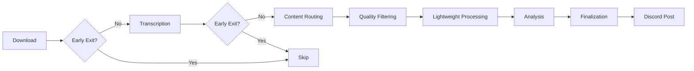

# Ultimate Discord Intelligence Bot - System Architecture

## Overview

The Ultimate Discord Intelligence Bot is a production-ready, multi-tenant intelligence system built on a modern 3-layer architecture. It orchestrates **111 specialized tools** across **18 autonomous AI agents** to provide comprehensive content analysis, fact-checking, and cross-platform monitoring.

**Key Statistics** (verified November 4, 2025):

- **Tools**: 111 (Observability: 26, Analysis: 23, Memory: 23, Ingestion: 19, Verification: 10, Discord: 4, Social Monitoring: 3, Web Automation: 1, Other: 2)
- **Agents**: 18 specialized agents with role-based tool access
- **Architecture**: 3-layer (Platform/Domains/App)
- **Multi-tenancy**: Complete workspace and resource isolation

## Three-Layer Architecture

The system follows domain-driven design principles with clear separation of concerns:

### Layer 1: Platform (`src/platform/`)

Infrastructure and cross-cutting concerns that all applications can use:

```text
src/platform/
├── core/              # StepResult protocol, configuration
├── http/              # Resilient HTTP (circuit breakers, retries)
├── cache/             # Multi-level caching (L1/L2/L3)
├── llm/               # Provider-agnostic LLM routing
├── rl/                # Reinforcement learning (contextual bandits)
├── observability/     # Prometheus metrics, Langfuse tracing
├── security/          # Rate limiting, privacy controls
├── prompts/           # Prompt engineering (DSPy)
└── rag/               # RAG capabilities (LlamaIndex)
```

**Key Components**:

- **StepResult Pattern**: Unified error handling (`src/platform/core/step_result.py`)
- **HTTP Layer**: All network I/O via `resilient_get/resilient_post/retrying_*`
- **LLM Router**: Quality/cost/latency policies with RL-based model selection
- **Observability**: Prometheus `/metrics`, Langfuse traces, structured logging

### Layer 2: Domains (`src/domains/`)

Business logic organized by bounded contexts:

```text
src/domains/
├── orchestration/     # CrewAI agents, tasks, crews
│   ├── crewai/        # CrewAI-specific components
│   ├── agents/        # Agent definitions
│   └── crew/          # Crew builders
├── ingestion/         # Multi-platform content ingestion
│   ├── pipeline/      # Ingestion orchestrator
│   └── providers/     # YouTube, TikTok, Twitter, etc.
├── intelligence/      # Analysis & verification
│   ├── analysis/      # Content processing tools (24)
│   └── verification/  # Fact-checking tools (11)
└── memory/            # Storage & retrieval
    ├── vector/        # Qdrant integration
    ├── graph/         # Neo4j knowledge graphs
    └── continual/     # Mem0, HippoRAG
```

### Layer 3: App (`src/app/`)

Application-specific code and entry points:

```text
src/app/
├── main.py            # Application entry point
├── crew_executor.py   # CrewAI execution
├── discord/           # Discord bot
│   ├── bot.py         # Bot implementation
│   ├── commands/      # Slash commands
│   └── events/        # Event handlers
└── config/            # App configuration
    ├── settings.py    # Global settings
    └── agents.yaml    # Agent definitions
```

## Content Pipeline Architecture

The core pipeline orchestrates multi-platform content ingestion and analysis:

**Location**: `src/ultimate_discord_intelligence_bot/pipeline_components/orchestrator.py`

### Pipeline Stages



**Stages**:

1. **Download**: Multi-platform content acquisition (YouTube, TikTok, Twitter, Reddit, Instagram, Discord, Twitch)
1. **Transcription**: Audio/video → text via Whisper or AssemblyAI
1. **Content Routing**: Classify content type and route appropriately
1. **Quality Filtering**: Assess content quality and filter low-quality items
1. **Lightweight Processing**: Low-cost preprocessing and setup before full analysis
1. **Analysis** (Parallel):
   - Logical fallacy detection
   - Perspective synthesis
   - Sentiment analysis
1. **Finalization**: Memory storage, graph updates, Discord posting

**Early Exit Checkpoints**: Configured via `config/early_exit.yaml` to skip processing based on content type or quality thresholds.

**Configuration**: Environment variables (`.env`) and YAML configs (`config/content_types.yaml`, `config/early_exit.yaml`)

## Tool Ecosystem

### Tool Organization

**Total**: 111 tools organized across 9 categories (source: `tools/__init__.py::__all__`)

| Category | Count | Location | Purpose |
|----------|-------|----------|---------|
| Observability | 26 | `tools/observability/` | Metrics, monitoring, performance analytics |
| Analysis | 23 | `domains/intelligence/analysis/` | Content processing, sentiment, fallacy detection |
| Memory | 23 | `domains/memory/` | Vector search, graph memory, continual learning |
| Ingestion | 19 | `domains/ingestion/providers/` | Multi-platform content download |
| Verification | 10 | `domains/intelligence/verification/` | Fact-checking, claim extraction |
| Discord | 4 | `tools/` | Discord integration and posting |
| Social Monitoring | 3 | `tools/` | Cross-platform and X/Twitter monitoring |
| Web Automation | 1 | `tools/web/` | Playwright-driven browser automation |
| Other | 2 | `tools/` | Utilities (e.g., drive upload, content generation) |

### Tool Registration

All tools:

1. Inherit from `BaseTool` (`src/ultimate_discord_intelligence_bot/tools/_base.py`)
1. Return `StepResult` for uniform error handling
1. Export via `__all__` in their module
1. Register in `MAPPING` dictionary (`tools/__init__.py`)
1. Instrument metrics via `obs.metrics.get_metrics().counter("tool_runs_total")`

**Validation**: `scripts/validate_tools_exports.py` enforces registration compliance

## Agent System

### Agent Architecture

**Total**: 18 specialized agents with role-based tool access

**Registry**: `src/ultimate_discord_intelligence_bot/crew_components/tool_registry.py`

**Configuration**: `src/app/config/agents.yaml`

### Core Agents

1. **Mission Orchestrator**: Pipeline coordination, end-to-end mission execution
1. **Executive Supervisor**: Strategic oversight, quality control, governance
1. **Workflow Manager**: Task routing, dependency management, and execution flow
1. **Acquisition Specialist**: Multi-platform content download (YouTube, TikTok, Twitter, etc.)
1. **Transcription Engineer**: Audio/video transcription (Whisper, AssemblyAI)
1. **Analysis Cartographer**: Content analysis, sentiment, insight extraction
1. **Verification Director**: Fact-checking, claim extraction, confidence scoring
1. **Risk Intelligence Analyst**: Risk signals, anomalies, and escalation insights
1. **Persona Archivist**: Persona/profile curation and knowledge upkeep
1. **Knowledge Integrator**: Memory consolidation and knowledge graph alignment
1. **Signal Recon Specialist**: Signal discovery and cross-source correlation
1. **Trend Intelligence Scout**: Emerging trend detection and forecasting
1. **Research Synthesist**: Source synthesis and briefing preparation
1. **Intelligence Briefing Curator**: Executive-ready outputs and narratives
1. **Argument Strategist**: Claim structuring and argumentation quality
1. **System Reliability Officer**: Reliability, health checks, and resilience
1. **Community Liaison**: Community engagement and communications
1. **Autonomous Mission Coordinator**: Self-directed orchestration and recovery

### Agent-Tool Mapping

Agents are assigned tools based on their role. Example assignments:

- **Mission Orchestrator**: pipeline_tool, performance_analytics_tool, timeline_tool, mcp_call_tool
- **Acquisition Specialist**: multi_platform_download_tool, timeline_tool
- **Analysis Cartographer**: enhanced_analysis_tool, text_analysis_tool, timeline_tool
- **Verification Director**: claim_extractor_tool, fact_check_tool, timeline_tool

**Complete mapping**: See `ToolRegistry.get_tools_for_agent()` method

## StepResult Pattern

### Unified Error Handling

**Location**: `src/platform/core/step_result.py` (migrated from `src/ultimate_discord_intelligence_bot/step_result.py`)

**Purpose**: Standardized result wrapper for all tool and pipeline operations

### Methods

```python
StepResult.ok(result={...})              # Success
StepResult.skip(reason="...")            # Skipped step
StepResult.uncertain(result={...})       # Uncertain outcome
StepResult.fail("error", error_category=ErrorCategory.TIMEOUT, retryable=True)  # Failure
StepResult.with_context(metadata={...})  # Add metadata
```

**Required Fields**:

- `error_category`: `ErrorCategory` enum value on failures
- `metadata`: Dict with context for observability and retries

**Validation**: `make compliance` runs HTTP and StepResult audits

## Multi-Tenancy

### Tenant Isolation

**Location**: `src/ultimate_discord_intelligence_bot/tenancy/context.py`

**Primitives**:

- `with_tenant(TenantContext(...))`: Scopes execution to tenant
- `current_tenant()`: Returns active tenant context
- `mem_ns(ctx, "collection")`: Generates namespaced keys

**Scopes**: Storage, cache, metrics, thread contexts

```python
with with_tenant(TenantContext(tenant_id="workspace_123")):
    # All operations isolated to this tenant
    result = tool.run(...)
    metrics.counter("operations").inc()  # Tenant-scoped
```

## Observability & Monitoring

### Metrics (Prometheus)

**Endpoint**: `/metrics` (enabled when `ENABLE_PROMETHEUS_ENDPOINT=1`)

**Registry**: `src/ultimate_discord_intelligence_bot/obs/metrics.py`

**Specs**: `src/ultimate_discord_intelligence_bot/obs/metric_specs.py`

**Required Labels**: `tool`, `operation`, `status`, `agent`, `tenant`

**Common Metrics**:

- `tool_runs_total`: Counter for tool executions
- `agent_operations_total`: Counter for agent operations
- `agent_duration_seconds`: Histogram for agent timing
- `pipeline_stage_duration_seconds`: Pipeline stage timing
- `http_requests_total`: HTTP request counter

### Tracing (Langfuse)

**Service**: `src/platform/observability/langfuse_service.py`

**Feature Flag**: `ENABLE_LANGFUSE_EXPORT`

**Features**:

- StepResult-aware sanitization
- Tenant metadata tagging
- Span creation and management
- Trace finalization

### Logging

- Structured logging with JSON format
- Tenant isolation in log context
- Log levels: DEBUG, INFO, WARNING, ERROR, CRITICAL
- Configurable via `LOG_LEVEL` environment variable

## HTTP & Network Layer

### Resilient HTTP Client

**Location**: `src/platform/http/http_utils.py`

**Compatibility Shim**: `src/ultimate_discord_intelligence_bot/core/http_utils.py`

**Functions**:

- `resilient_get(url, ...)`: GET with circuit breakers
- `resilient_post(url, ...)`: POST with retries
- `retrying_get(url, ...)`: GET with configurable retry logic
- `retrying_post(url, ...)`: POST with retry logic
- `http_request_with_retry(...)`: Generic retry wrapper

**Features**:

- Circuit breaker protection
- Exponential backoff retries
- Timeout management
- Rate limit handling
- Request/response logging

**Guardrail**: `scripts/validate_http_wrappers_usage.py` enforces usage (no direct `requests.*` calls)

### Configuration

**Retry Precedence**:

1. Function call argument
1. Config/tenant settings
1. `RETRY_MAX_ATTEMPTS` environment variable
1. Secure config default

**Location**: `src/platform/http/retry_config.py`

## Memory Systems

### Vector Storage (Qdrant)

**Provider**: `src/domains/memory/vector/`

**Client**: `memory/qdrant_provider.get_qdrant_client()`

**Collections**: Configured in `config/qdrant_collections.yaml`

**Features**:

- Semantic search
- Vector embeddings (OpenAI, local models)
- Collection management
- Multi-tenant isolation

### Graph Memory (Neo4j)

**Location**: `src/domains/memory/graph/`

**Features**:

- Knowledge graph construction
- Relationship mapping
- Entity extraction
- Graph queries

### Continual Learning

**Mem0**: Long-term memory with automatic consolidation

**HippoRAG**: Hippocampal-inspired memory architecture

**Location**: `src/domains/memory/continual/`

## LLM Routing & Providers

### Provider-Agnostic Router

**Location**: `src/platform/llm/`

**Configuration**:

- `LLM_PROVIDER_ALLOWLIST`: Comma-separated provider list
- `ROUTER_POLICY`: `quality_first` | `cost` | `latency`
- `QUALITY_FIRST_TASKS`: Tasks requiring quality-first routing

**Supported Providers**:

- OpenAI
- Anthropic (Claude)
- Google (Gemini)
- OpenRouter
- Groq
- Together AI
- Cohere
- Mistral
- Fireworks
- Perplexity
- X.AI
- DeepSeek
- Azure OpenAI
- AWS Bedrock

### Reinforcement Learning

**Location**: `src/platform/rl/`

**Algorithm**: Contextual bandits (LinUCB)

**Features**:

- Adaptive model selection
- Reward shaping
- Quality score feedback
- Cost-aware routing

**Configuration**:

- `ENABLE_RL_OPTIMIZATION`: Enable RL routing
- `REWARD_QUALITY_WEIGHT`: Weight for quality in reward function

## API Surfaces

### FastAPI Server

**Location**: `src/server/app.py`

**Endpoints**:

- `POST /api/v1/analyze`: Content analysis
- `POST /a2a`: A2A JSON-RPC adapter
- `GET /metrics`: Prometheus metrics
- `GET /health`: Health check
- `GET /ready`: Readiness probe

**Features**:

- CORS middleware
- Rate limiting
- API caching
- Metrics collection

### A2A JSON-RPC Adapter

**Location**: `src/server/a2a_adapter.py`

**Tools**: `src/server/a2a_tools.py`

**Methods**: Exposed via JSON-RPC 2.0

### MCP Server

**Location**: `src/mcp_server/`

**Namespaces**: 9 namespaces, 30 total tools

**Registry**: `_SAFE_REGISTRY` in MCP server modules

**Validation**: `scripts/validate_mcp_tools.py`

## Guardrails & Compliance

### Enforcement Scripts

**HTTP Compliance**: `scripts/validate_http_wrappers_usage.py`

- Enforces use of resilient HTTP wrappers
- Blocks direct `requests.*` calls

**Tool Compliance**: `scripts/validate_tools_exports.py`

- Validates tool registration
- Checks `__all__` exports

**Metrics Compliance**: `scripts/metrics_instrumentation_guard.py`

- Ensures metric instrumentation
- Validates label requirements

**Deprecated Directories**: `scripts/guards/deprecated_directories_guard.py`

- Blocks new code in `src/core/routing/`
- Blocks new code in `src/ai/routing/`
- Blocks new code in `src/performance/`

### Compliance Check

**Command**: `make compliance`

Runs:

- HTTP wrapper validation
- StepResult pattern audit
- Tool registration checks
- Metrics instrumentation validation

## Configuration Management

### Environment Variables

**Template**: `env.example` (496 lines)

**Categories**:

- Core services (Discord, LLM APIs, databases)
- Feature flags (50+ flags)
- LLM provider routing
- Performance settings
- Observability configuration

### YAML Configuration

**Location**: `config/`

**Files**:

- `content_types.yaml`: Content routing thresholds
- `early_exit.yaml`: Early exit checkpoints
- `qdrant_collections.yaml`: Vector collections
- `policy.yaml`: Policy definitions
- `security.yaml`: Security settings

## Migration Status

### Completed ✅

- Tools consolidated to single source
- HTTP wrappers unified under `src/platform/http/`
- Cache layer consolidated (ADR-0001)
- Memory systems unified (ADR-0002)
- Routing consolidated (ADR-0003)
- Orchestrator unified (ADR-0004)

### In Progress 🔄

- Legacy code migration from `src/ultimate_discord_intelligence_bot/` to `src/domains/`
- Tool registration updates for domain structure
- Import path updates for migrated components

## Performance Optimization

### Multi-Level Caching

**L1**: In-memory cache (TTL-based)
**L2**: Redis cache (distributed)
**L3**: Semantic cache (LLM response caching)

**ADR**: `docs/architecture/adr-0001-cache-platform.md`

### Prompt Compression

**Feature**: `ENABLE_PROMPT_COMPRESSION`

**Method**: Token reduction while preserving semantics

### Model Routing

**Strategy**: RL-based selection optimizing for quality/cost/latency

**Bandits**: Contextual bandits with exploration/exploitation

## References

### Key Documents

- [ADR-0001: Cache Platform](adr-0001-cache-platform.md)
- [ADR-0002: Memory Unification](adr-0002-memory-unification.md)
- [ADR-0003: Routing Consolidation](adr-0003-routing-consolidation.md)
- [ADR-0004: Orchestrator Unification](adr-0004-orchestrator-unification.md)
- [Agent System Details](agent_system.md)
- [Pipeline Architecture](pipeline_architecture.md)
- [Memory System](memory_system.md)

### Code References

- Tool Registry: `src/ultimate_discord_intelligence_bot/tools/__init__.py`
- Agent Registry: `src/ultimate_discord_intelligence_bot/crew_components/tool_registry.py`
- Pipeline Orchestrator: `src/ultimate_discord_intelligence_bot/pipeline_components/orchestrator.py`
- StepResult: `src/platform/core/step_result.py`
- HTTP Utils: `src/platform/http/http_utils.py`

---

**Last Updated**: November 3, 2025
**Version**: 2.0
**Status**: Current and verified against codebase

## Agents and tasks

The `src/ultimate_discord_intelligence_bot/crew.py` file describes the higher level
CrewAI agents and tasks used when running the project under the CrewAI runtime.
Agents wrap language models with specific goals while tasks orchestrate those
agents to perform monitoring, downloading, analysis and posting activities.

## Tools

Each interaction with an external system is encapsulated in a tool living under
`src/ultimate_discord_intelligence_bot/tools/`.

- `yt_dlp_download_tool.py` – generic `yt-dlp` wrapper with subclasses for
  YouTube, Twitch, Kick, Instagram, TikTok, Reddit, Discord and X/Twitter downloads and an
  optional quality parameter to cap resolution.
- `multi_platform_download_tool.py` – dispatches to the appropriate downloader
  based on the URL (including `vm.tiktok.com`/`vt.tiktok.com` aliases) and
  returns `platform: "unknown"` for unsupported links.
- `drive_upload_tool.py` – uploads files to Google Drive and produces shareable
  links suitable for Discord embeds. If Google credentials are not configured or
  the Drive API is unavailable, the system automatically falls back to a bypass
  variant (`drive_upload_tool_bypass.py`) and marks the Drive step as skipped
  without failing the overall run.
- `audio_transcription_tool.py` – lazily loads Whisper models to transcribe
  audio.
- `text_analysis_tool.py` – performs sentiment and keyword extraction using
  NLTK (with a degraded stub fallback when NLTK is unavailable, so pipelines
  continue to run without hard dependency on NLTK data).
- `sentiment_tool.py` – standalone sentiment classifier using VADER or a
  simple lexical fallback.
- `logical_fallacy_tool.py` – flags basic logical fallacies in transcripts.
- `claim_extractor_tool.py` – stub for future factual claim extraction.
- `perspective_synthesizer_tool.py` – generates alternative viewpoints from the
  analysed text using the shared `PromptEngine`, `OpenRouterService` and
  `MemoryService` for contextual grounding.
- `discord_post_tool.py` – posts either embeds or direct uploads to Discord via a
  webhook.
- `discord_private_alert_tool.py` – sends operational alerts to a restricted
  webhook for monitoring.
- `tools/platform_resolver/` – lookup helpers turning platform handles into
  canonical channel or profile references. They support the creator profile
  system described below.

## Model Context Protocol (MCP)

CrewAI uses the MCP to let agents invoke tools safely.  In this project the
pipeline tools are simple functions but they can be exposed to MCP-aware agents
through the CrewAI framework.  The declarative agent and task configuration files
allow other MCP compatible runtimes to drive the same tools.
AST-based tests verify that those configuration files stay in sync with
`crew.py` and that each agent exposes the expected tools, preventing subtle
misconfigurations.

## Recent refactor

To simplify orchestration and improve reliability the pipeline now wraps all
step results in a small dataclass `StepResult`.  This removes repetitive status
handling, provides a typed interface for callers and ensures every stage returns
structured data.

## Global services

A set of lightweight services are available under
`src/ultimate_discord_intelligence_bot/services` to support efficient and grounded
language-model usage across the system:

- **PromptEngine** – central prompt builder and token counter using
  `tiktoken` and `transformers` tokenizers where available.
- **OpenRouterService** – dynamic model router with offline fallback.
  Defaults may be customised via `OPENROUTER_GENERAL_MODEL` and
  `OPENROUTER_ANALYSIS_MODEL`.
- **LearningEngine** – epsilon‑greedy policy that records routing rewards.
- **TokenMeter** – estimates request cost across models and enforces a
  per-request ceiling via `COST_MAX_PER_REQUEST`.
- **LLMCache** – deterministic prompt→response cache with configurable TTL so
repeated prompts can be served without requerying models.
- **MemoryService** – minimal in-memory store for contextual lookups with
  optional case-insensitive metadata filtering. All entries are stored under a
  `<tenant>:<workspace>` namespace to prevent cross-tenant leakage. Calls may
  pass a `metadata` dictionary whose pairs must match stored metadata for a
  memory to be returned. Lookups honour a `limit` parameter where values below
  `1` or blank queries return no results. The service grounds the
  `PerspectiveSynthesizerTool`.
- **Profiles module** – dataclasses and a SQLite-backed `ProfileStore` to
  maintain verified creator, show and staff information. Seed data for the
  H3/H3 Podcast/Hasan ecosystem lives in `profiles.yaml` and resolution tools
  populate canonical IDs at runtime. The store now tracks cross-profile
  collaborations and exposes helper methods to record and query those links.
- **ContentPoller** – simple scheduler that updates profile `last_checked`
  timestamps, forming the basis of continuous ingestion.
- **EvaluationHarness** – runs prompts across models, logging latency and
  token usage for offline analysis and future training.

## Potential optimisations

- **Parallelism** – independent steps such as Drive uploads and transcription
  could be processed concurrently to reduce end-to-end latency.
- **Batch processing** – when monitoring multiple channels it may be more
  efficient to queue downloads and run them in batches.
- **Alternative tools** – open source libraries such as `pytube` or `discord.py`
  could replace shell invocations for tighter integration and better error
  reporting.
- **Caching** – caching of transcripts or analysis for unchanged videos would
  avoid redundant processing.

## Conclusion

The current architecture cleanly separates concerns into dedicated tools and a
coordinating pipeline.  The new `StepResult` abstraction further improves
maintainability.  With additional concurrency and caching the system can scale
further while remaining easy to reason about.
