# Ultimate Discord Intelligence Bot - Data Flow Diagrams

**Generated**: 2025-01-22  
**Analysis Scope**: End-to-end pipeline flows and data transformations  
**Status**: Phase 1 - Architecture & System Understanding

## Executive Summary

This document provides comprehensive data flow diagrams for the Ultimate Discord Intelligence Bot, covering the complete content processing pipeline from multi-platform input to Discord output, including agent interactions, tool usage, and data transformations.

## Core Content Processing Pipeline

### 1. End-to-End Content Flow

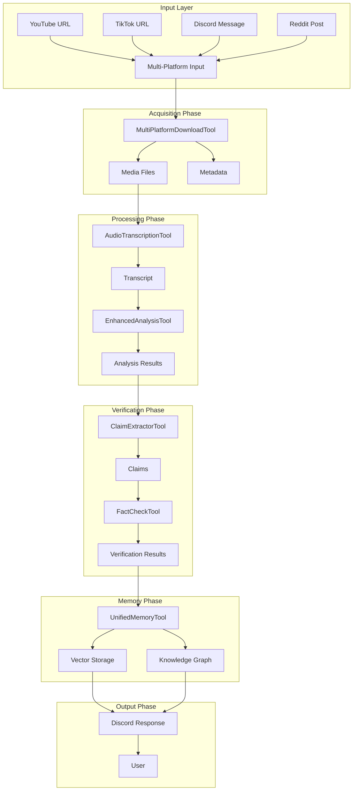

### 2. Agent Interaction Flow

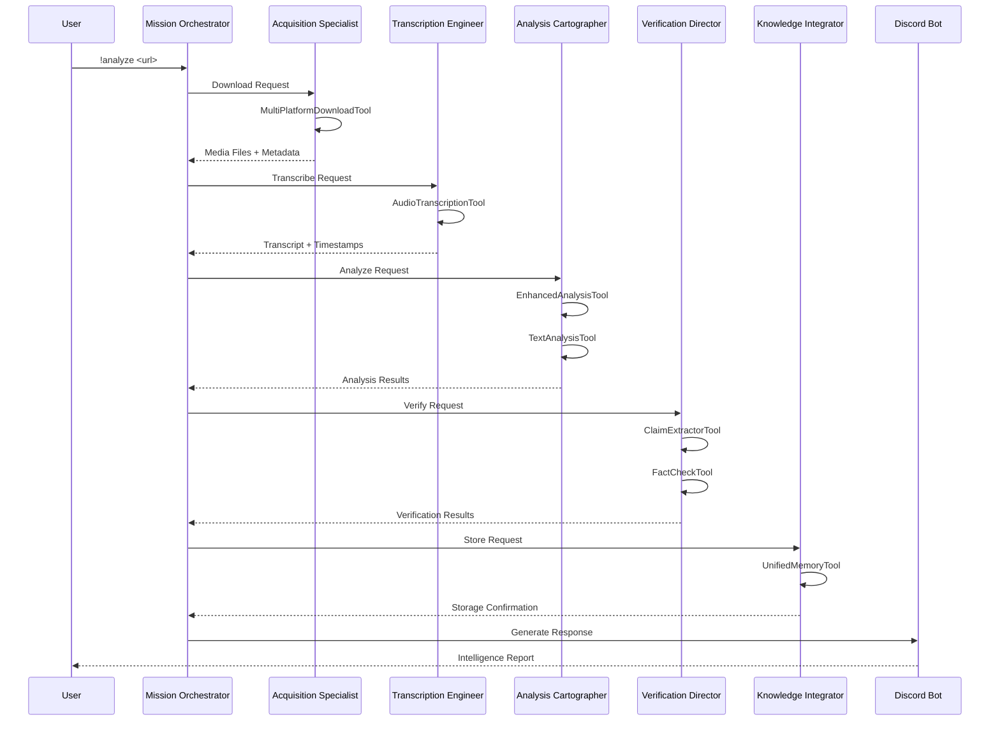

## Detailed Component Flows

### 3. Acquisition Phase Data Flow

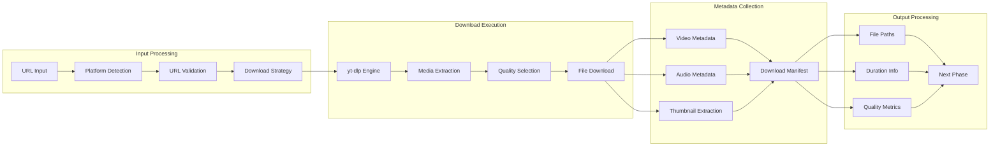

### 4. Analysis Phase Data Flow

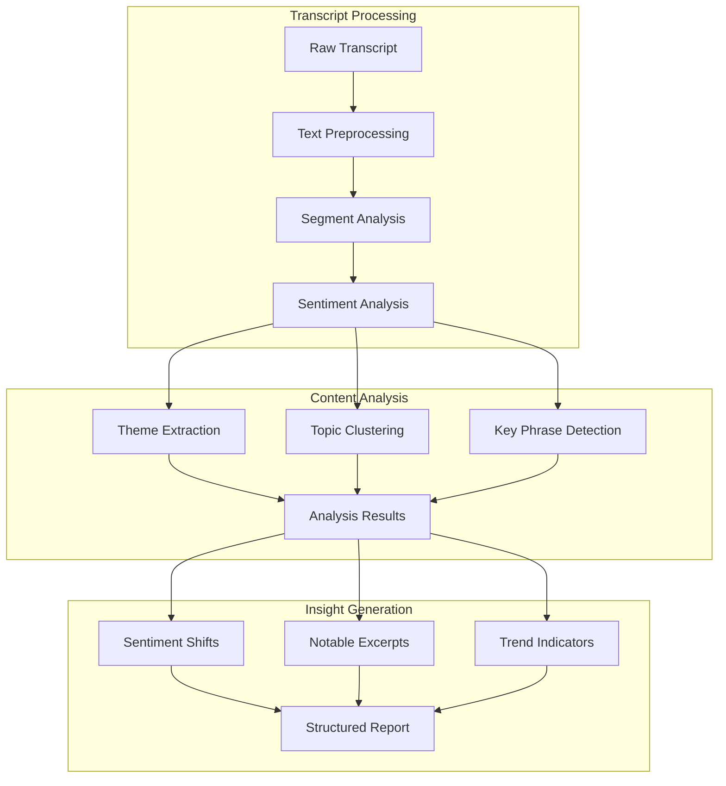

### 5. Verification Phase Data Flow

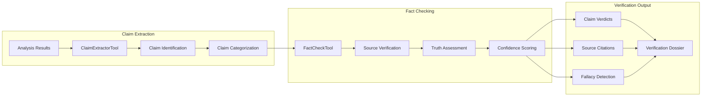

### 6. Memory Phase Data Flow

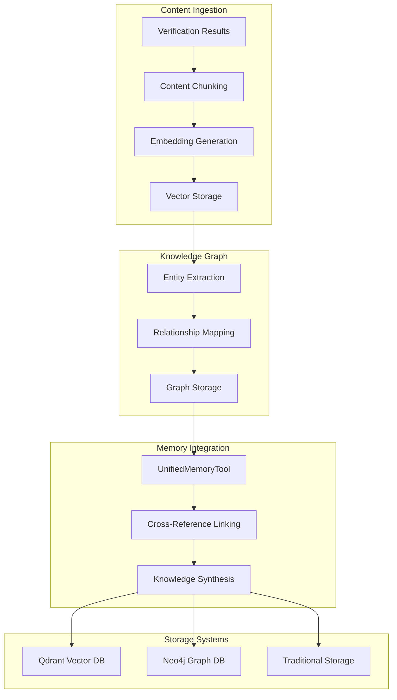

## Service Layer Data Flows

### 7. PromptEngine Data Flow

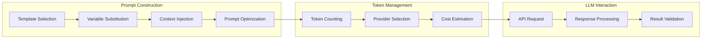

### 8. MemoryService Data Flow

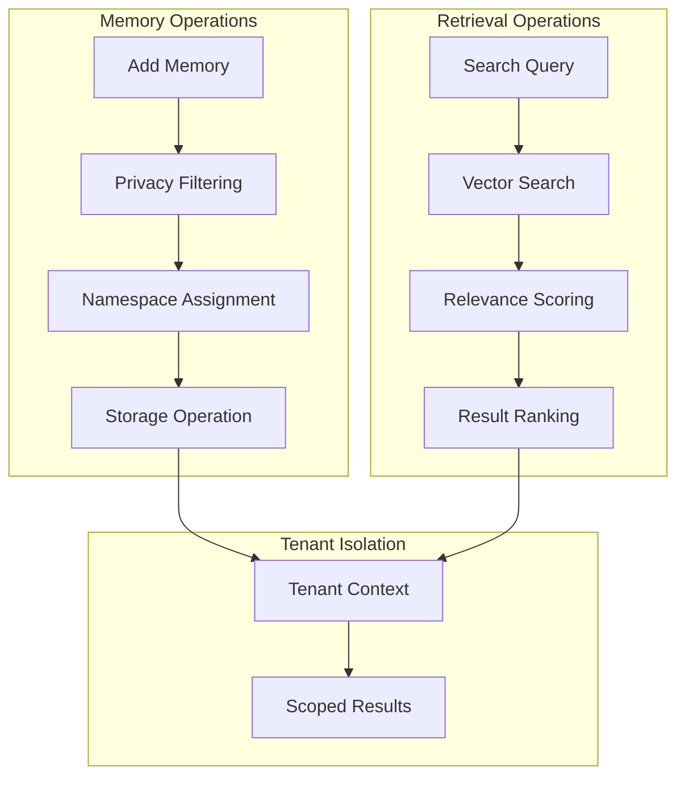

### 9. Caching Layer Data Flow

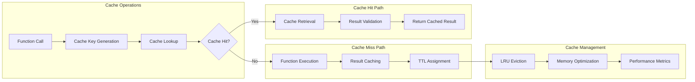

## Error Handling Data Flows

### 10. Error Processing Flow

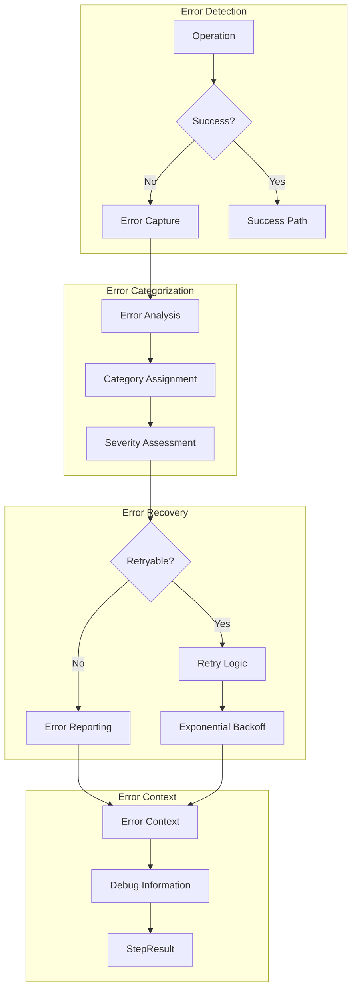

## Performance Data Flows

### 11. Performance Monitoring Flow

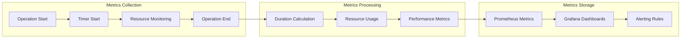

### 12. Lazy Loading Flow

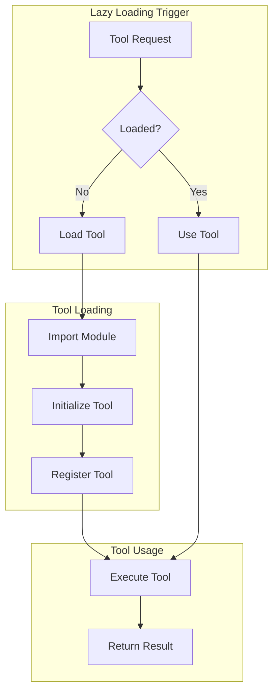

## Tenant Isolation Data Flows

### 13. Multi-Tenant Data Flow

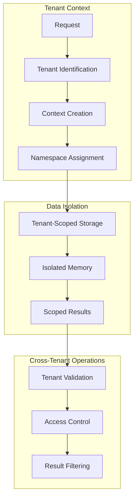

## Integration Data Flows

### 14. External Service Integration

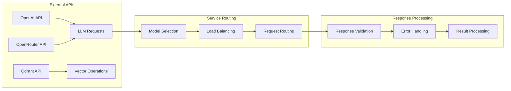

## Data Transformation Flows

### 15. Content Transformation Pipeline

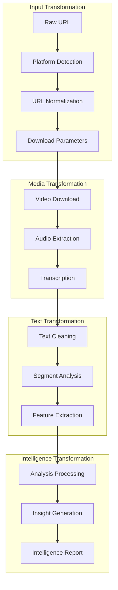

## Summary

This comprehensive data flow documentation covers:

1. **End-to-End Pipeline**: Complete content processing flow
2. **Component Flows**: Detailed data transformations per phase
3. **Service Flows**: Internal service interactions
4. **Error Flows**: Error handling and recovery patterns
5. **Performance Flows**: Monitoring and optimization
6. **Tenant Flows**: Multi-tenant isolation patterns
7. **Integration Flows**: External service interactions
8. **Transformation Flows**: Data transformation patterns

Each flow diagram provides a clear understanding of how data moves through the system, enabling better debugging, optimization, and maintenance of the Ultimate Discord Intelligence Bot.

---

**Analysis Complete**: Data Flow Diagrams  
**Next Phase**: Dependency Graph & Import Analysis  
**Status**: Ready for Phase 1.2 execution
