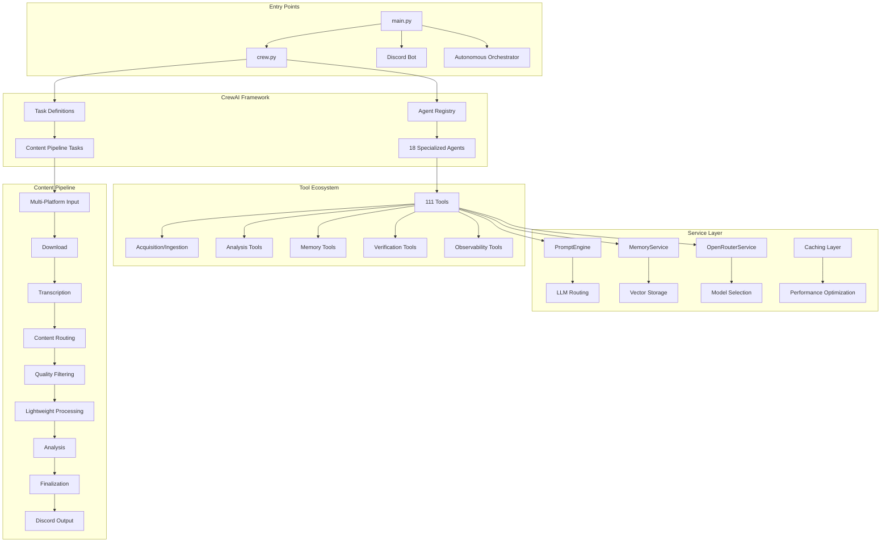
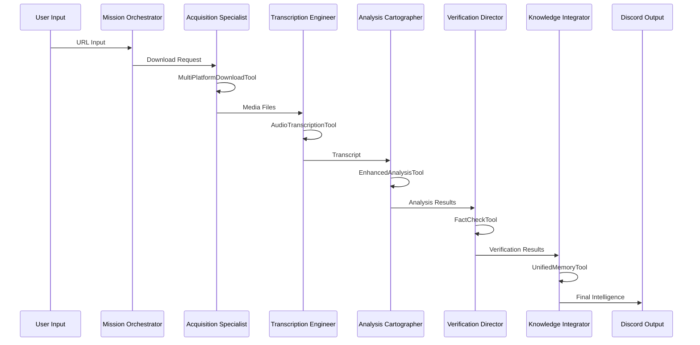
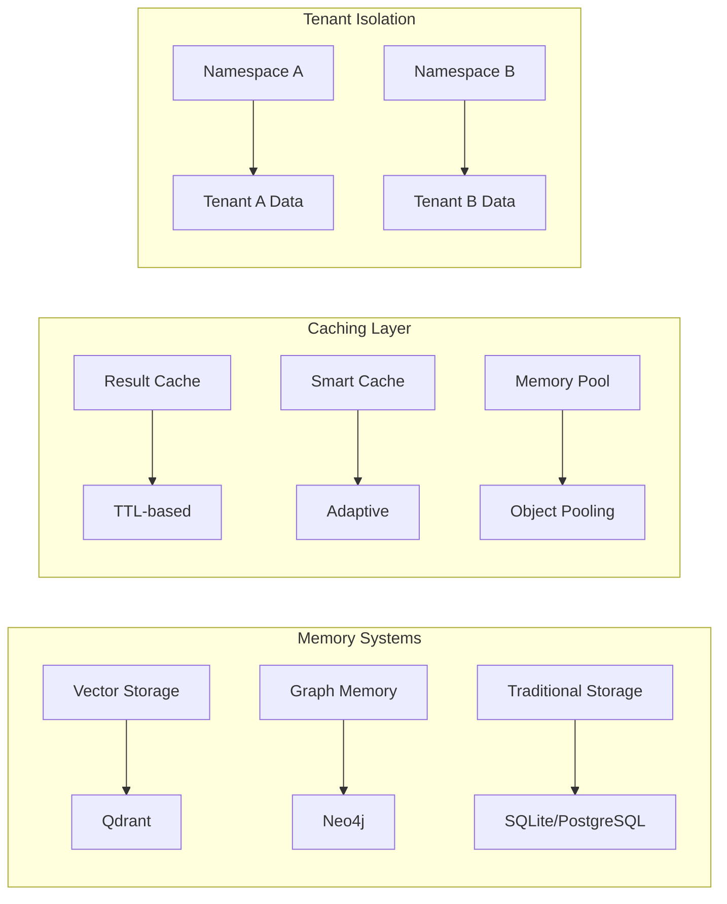

# Ultimate Discord Intelligence Bot - Complete System Architecture

**Generated**: November 3, 2025
**Current Implementation** (verified):

- **Agents**: 18 specialized agents (crew_components/tool_registry.py)
- **Tools**: 111 across 9 categories (tools/**init**.py::**all**)
- **Pipeline**: 7 phases (pipeline_components/orchestrator.py: 1637 lines)
- **Architecture**: 3-layer design (Platform at src/platform, Domains at src/domains, App at src/app)

**Analysis Scope**: Complete codebase deep dive
**Status**: Phase 1 - Architecture & System Understanding

## Executive Summary

The Ultimate Discord Intelligence Bot is a sophisticated multi-agent system built on CrewAI, featuring 18 specialized agents, 111 tools, and comprehensive content processing capabilities. The system follows a modular 3-layer architecture with clear separation of concerns, tenant-aware design, and advanced performance optimization.

## System Overview

## Core Architecture Components

### 1. Entry Points & Orchestration

#### Main Application (`main.py`)

- **Purpose**: CLI entry point with enhanced monitoring
- **Commands**: `run`, `train`, `replay`, `test`
- **Features**: Quality monitoring, performance alerts, execution tracking
- **Integration**: Enhanced crew integration with quality thresholds

#### Crew Definition (`crew.py`)

- **Architecture**: Modular agent system with registry-based loading
- **Agents**: 18 specialized agents with fallback mechanisms
- **Tasks**: 5 core workflow tasks with dependency management
- **Features**: Telemetry disabled, async execution support

#### Content Pipeline (`pipeline_components/orchestrator.py`)

- **Purpose**: Modular content processing orchestrator with early exits
- **Components**: ContentPipeline, privacy filtering, metrics tracking
- **Flow**: Multi-Platform → Download → Transcription → Content Routing → Quality Filtering → Lightweight Processing → Analysis → Finalization → Discord

### 2. Agent System Architecture

#### Agent Registry System

- **Base Class**: `BaseAgent` with standardized interface
- **Registry**: `AGENT_REGISTRY` with dynamic loading
- **Fallback**: Graceful degradation when agents fail to load
- **Categories**: Executive, Operational, Specialized, Support

#### Agent Categories

**Executive & Strategic Layer**:

- `executive_supervisor`: Strategic oversight and resource allocation
- `workflow_manager`: Task routing and dependency management
- `mission_orchestrator`: End-to-end mission coordination

**Operational Layer**:

- `acquisition_specialist`: Multi-platform content capture
- `transcription_engineer`: Audio/linguistic processing
- `analysis_cartographer`: Content analysis and insights
- `verification_director`: Fact-checking and claim verification

**Specialized Agents**:

- `knowledge_integrator`: Memory and knowledge management
- `system_reliability_officer`: Operations and reliability
- `community_liaison`: Community engagement

### 3. Tool Ecosystem (111 Tools)

#### Tool Architecture

- **Base Class**: `BaseTool` with StepResult pattern
- **Categorization**: Acquisition, Analysis, Memory, Verification, Observability
- **Features**: Lazy loading, result caching, tenant isolation
- **Standards**: Type hints, error handling, documentation

#### Tool Categories

**Acquisition/Ingestion** (19 tools):

- `MultiPlatformDownloadTool`: Unified platform downloader
- `AudioTranscriptionTool`: Speech-to-text processing
- `DiscordDownloadTool`: Discord-specific content
- `TikTokEnhancedDownloadTool`: TikTok content capture

**Analysis Tools** (23 tools):

- `EnhancedAnalysisTool`: Comprehensive content analysis
- `TextAnalysisTool`: Linguistic analysis
- `SentimentTool`: Emotion and sentiment detection
- `TrendAnalysisTool`: Trend identification and forecasting
- `MultimodalAnalysisTool`: Cross-modal content analysis

**Memory Tools** (23 tools):

- `UnifiedMemoryTool`: Centralized memory management
- `VectorSearchTool`: Semantic search capabilities
- `RAGHybridTool`: Retrieval-augmented generation
- `Mem0MemoryTool`: Advanced memory integration
- `GraphMemoryTool`: Knowledge graph management

**Verification Tools** (10 tools):

- `FactCheckTool`: Claim verification
- `ClaimExtractorTool`: Claim identification
- `TruthScoringTool`: Truthfulness assessment
- `ConsistencyCheckTool`: Content consistency validation

### 4. Service Layer Architecture

#### PromptEngine (`services/prompt_engine.py`)

- **Purpose**: Centralized prompt construction and token counting
- **Features**: Provider-aware token counting, prompt templates, optimization
- **Integration**: OpenTelemetry tracing, metrics collection
- **Providers**: OpenAI (tiktoken), Transformers, fallback whitespace

#### MemoryService (`services/memory_service.py`)

- **Purpose**: In-memory retrieval service with tenant isolation
- **Features**: Privacy filtering, namespace management, metrics tracking
- **Integration**: Tenant context, observability, StepResult pattern
- **Storage**: In-memory with optional persistence

#### OpenRouterService (`services/openrouter_service.py`)

- **Purpose**: LLM routing and model selection
- **Features**: Dynamic model selection, cost optimization, fallback mechanisms
- **Integration**: Performance monitoring, request budgeting

#### Caching Layer

- **ResultCache**: TTL-based caching with LRU eviction
- **SmartCache**: Adaptive caching strategies
- **Features**: Usage pattern analysis, automatic optimization
- **Performance**: Memory pooling, cache hit optimization

### 5. Tenancy & Context Management

#### TenantContext (`tenancy/context.py`)

- **Purpose**: Multi-tenant isolation and context management
- **Components**: Tenant ID, workspace ID, routing profile, budget tracking
- **Features**: Thread-local storage, context managers, namespace isolation
- **Integration**: All services respect tenant boundaries

#### Context Propagation

- **Thread Safety**: Thread-local storage for tenant context
- **Namespace Management**: Scoped memory and storage operations
- **Policy Binding**: Tenant-specific policies and configurations
- **Budget Tracking**: Per-tenant resource allocation

### 6. Configuration Management

#### Layered Configuration System

- **BaseConfig**: Core application settings
- **FeatureFlags**: Feature toggles and experimental features
- **PathConfig**: File and directory management
- **Validation**: Configuration validation and error handling

#### Feature Flags

- **Pattern**: `ENABLE_<AREA>_<FEATURE>`
- **Categories**: Core features, advanced features, performance features
- **Management**: Environment-based configuration
- **Documentation**: Auto-generated feature flag documentation

## Data Flow Architecture

### Content Processing Pipeline

### Memory & Storage Architecture

## Performance Architecture

### Optimization Strategies

#### Lazy Loading

- **Tool Loading**: On-demand tool instantiation
- **Agent Loading**: Dynamic agent registration
- **Service Loading**: Lazy service initialization
- **Impact**: Reduced startup time, memory efficiency

#### Caching Strategy

- **Result Caching**: TTL-based with LRU eviction
- **Smart Caching**: Usage pattern analysis
- **Memory Pooling**: Object reuse for expensive operations
- **Adaptive TTL**: Dynamic cache expiration

#### Memory Optimization

- **Resource Pooling**: Efficient object management
- **Memory Analysis**: Usage pattern monitoring
- **Garbage Collection**: Proactive memory cleanup
- **Tenant Isolation**: Scoped memory usage

## Quality Architecture

### Error Handling

- **StepResult Pattern**: Consistent error handling across all tools
- **Error Categories**: 50+ specific error types
- **Recovery Strategies**: Automatic retry logic
- **Context Preservation**: Rich error context for debugging

### Observability

- **Metrics Collection**: Prometheus integration
- **Tracing**: OpenTelemetry distributed tracing
- **Logging**: Structured logging with tenant isolation
- **Health Checks**: System health monitoring

### Testing Architecture

- **Test Structure**: 154 test files across unit, integration, E2E
- **Coverage Target**: 80% per pyproject.toml
- **Test Categories**: Tools, agents, services, pipeline
- **Quality Gates**: Format, lint, type, test, docs

## Security & Privacy Architecture

### Privacy Protection

- **PII Filtering**: Automatic PII detection and redaction
- **Data Retention**: Configurable retention policies
- **Audit Trails**: Comprehensive operation logging
- **Compliance**: GDPR, CCPA compliance features

### Security Measures

- **Input Validation**: Comprehensive input sanitization
- **Output Sanitization**: Safe content generation
- **Access Control**: Tenant-based access restrictions
- **Encryption**: Data encryption at rest and in transit

## Deployment Architecture

### Container Strategy

- **Docker**: Multi-stage builds for optimization
- **Kubernetes**: Production deployment manifests
- **Service Mesh**: Inter-service communication
- **Scaling**: Horizontal pod autoscaling

### CI/CD Pipeline

- **Quality Gates**: 22 GitHub workflows
- **Automated Testing**: Comprehensive test automation
- **Deployment**: Automated deployment pipelines
- **Monitoring**: Production monitoring and alerting

## Technology Stack

### Core Technologies

- **Python**: 3.10+ with modern features
- **CrewAI**: Multi-agent orchestration
- **Discord.py**: Discord bot integration
- **Qdrant**: Vector database
- **OpenAI/OpenRouter**: LLM services

### Development Tools

- **Ruff**: Code formatting and linting
- **MyPy**: Static type checking
- **Pytest**: Testing framework
- **Pre-commit**: Quality gate automation

### Infrastructure

- **Docker**: Containerization
- **Kubernetes**: Orchestration
- **Prometheus**: Metrics collection
- **Grafana**: Monitoring dashboards

## Architecture Principles

### Design Principles

1. **Modularity**: Clear separation of concerns
1. **Tenancy**: Multi-tenant isolation
1. **Performance**: Optimized for scale
1. **Reliability**: Fault-tolerant design
1. **Observability**: Comprehensive monitoring
1. **Security**: Privacy-first approach

### Quality Standards

1. **Type Safety**: Comprehensive type hints
1. **Error Handling**: Consistent error patterns
1. **Testing**: High test coverage
1. **Documentation**: Comprehensive documentation
1. **Performance**: Optimized execution
1. **Security**: Secure by design

## Next Steps

### Phase 2 Recommendations

1. **Dependency Analysis**: Complete dependency graph generation
1. **Performance Profiling**: Comprehensive performance analysis
1. **Test Coverage**: Detailed coverage analysis
1. **Documentation**: Complete API documentation
1. **Monitoring**: Enhanced observability setup

### Strategic Initiatives

1. **Scalability**: Horizontal scaling improvements
1. **Performance**: Advanced optimization techniques
1. **Security**: Enhanced security measures
1. **Integration**: Additional platform support
1. **Analytics**: Advanced analytics capabilities

---

**Analysis Complete**: Phase 1 - Architecture & System Understanding
**Next Phase**: Dependency Graph & Import Analysis
**Status**: Ready for Phase 2 execution
