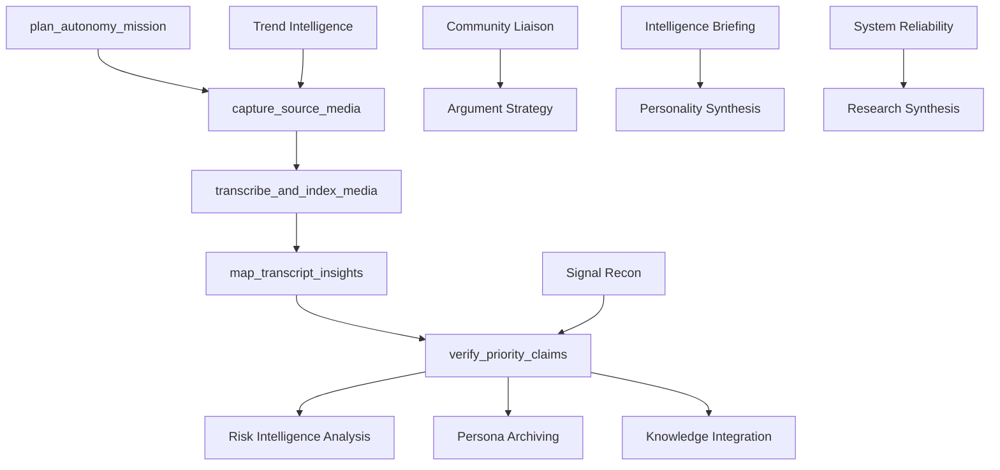

# Agent System Architecture

## Overview

The Ultimate Discord Intelligence Bot uses a CrewAI-based multi-agent system with 14 specialized agents orchestrated for autonomous content analysis. This system provides comprehensive intelligence gathering, analysis, verification, and community engagement capabilities across multiple platforms.

## System Architecture

```mermaid
graph TB
    subgraph "Mission Orchestration Layer"
        MO[Mission Orchestrator]
    end
    
    subgraph "Content Acquisition Layer"
        AS[Acquisition Specialist]
        TE[Transcription Engineer]
    end
    
    subgraph "Analysis & Intelligence Layer"
        AC[Analysis Cartographer]
        VD[Verification Director]
        RIA[Risk Intelligence Analyst]
        PA[Persona Archivist]
    end
    
    subgraph "Knowledge Management Layer"
        KI[Knowledge Integrator]
        RS[Signal Recon Specialist]
        TIS[Trend Intelligence Scout]
    end
    
    subgraph "Community & Communication Layer"
        CL[Community Liaison]
        ARG[Argument Strategist]
        IBC[Intelligence Briefing Curator]
        PSM[Personality Synthesis Manager]
    end
    
    subgraph "System Operations Layer"
        SRO[System Reliability Officer]
        RS2[Research Synthesist]
    end
    
    MO --> AS
    MO --> TE
    MO --> AC
    MO --> VD
    MO --> RIA
    MO --> PA
    MO --> KI
    MO --> RS
    MO --> TIS
    MO --> CL
    MO --> ARG
    MO --> IBC
    MO --> PSM
    MO --> SRO
    MO --> RS2
```

## Agent Catalog

### 1. Mission Orchestrator Agent

**Role:** Autonomy Mission Orchestrator  
**Goal:** Coordinate end-to-end missions, sequencing depth, specialists, and budgets.

**Backstory:**
> You sit at the flight deck for every autonomous run. You convert ambiguous requests into staged workflows, monitor request budgets, and determine when to escalate depth, social listening, or performance instrumentation. When edge cases appear you log decisive guidance so downstream teams inherit clean context.

**Key Responsibilities:**

- Convert ambiguous requests into structured workflows
- Monitor mission budgets and resource allocation
- Determine escalation strategies for complex scenarios
- Coordinate handoffs between specialist agents
- Maintain mission context and decision logs

**Performance Metrics:**

- Accuracy Target: 90%
- Reasoning Quality: 90%
- Response Completeness: 85%
- Tool Usage Efficiency: 90%

**Primary Tools:**

- `pipeline_tool` - Triggers content ingestion pipeline
- `advanced_performance_analytics_tool` - Analyzes system performance
- `timeline_tool` - Manages mission timelines and dependencies
- `perspective_synthesizer_tool` - Synthesizes multi-agent perspectives
- `mcp_call_tool` - Cross-tenant capability access

**Reasoning Framework:**

- Style: Strategic
- Confidence Threshold: 75%
- Uncertainty Handling: Explicit quantification
- Verification Requirements: Multiple sources

---

### 2. Acquisition Specialist

**Role:** Acquisition Specialist  
**Goal:** Capture pristine source media and metadata from every supported platform.

**Backstory:**
> You know every rate limit, resolver quirk, and quality fallback. When a download fails you swap strategies, elevate credentials, or convert to an alternate resolver so that the mission always begins with the highest quality capture available.

**Key Responsibilities:**

- Multi-platform content acquisition (YouTube, Twitch, TikTok, Reddit, Discord)
- Quality optimization and format selection
- Rate limit management and authentication
- Metadata extraction and validation
- Fallback strategy implementation

**Performance Metrics:**

- Accuracy Target: 95%
- Reasoning Quality: 85%
- Response Completeness: 85%
- Tool Usage Efficiency: 90%

**Primary Tools:**

- `multi_platform_download_tool` - Generic content capture
- Platform-specific downloaders (`youtube_download_tool`, `twitch_download_tool`, etc.)
- Resolvers (`podcast_resolver_tool`, `social_resolver_tool`, etc.)
- `drive_upload_tool` - Artifact storage

**Reasoning Framework:**

- Style: Operational
- Confidence Threshold: 80%
- Uncertainty Handling: Explicit quantification
- Verification Requirements: Multiple sources

---

### 3. Transcription Engineer

**Role:** Transcription & Index Engineer  
**Goal:** Deliver reliable transcripts, indices, and artifacts for every capture.

**Backstory:**
> You align speech, timestamps, and storage. When transcripts degrade you rerun at alternate qualities, slice long files, or repair indexing so downstream analysis always receives grounded text.

**Key Responsibilities:**

- Audio transcription with quality optimization
- Timestamp alignment and indexing
- Searchable index generation
- Temporal anchor maintenance
- Artifact publication and validation

**Performance Metrics:**

- Accuracy Target: 92%
- Reasoning Quality: 88%
- Response Completeness: 85%
- Tool Usage Efficiency: 90%

**Primary Tools:**

- `audio_transcription_tool` - Primary transcription engine
- `transcript_index_tool` - Searchable index generation
- `timeline_tool` - Temporal synchronization
- `drive_upload_tool` - Artifact publication

**Reasoning Framework:**

- Style: Analytical
- Confidence Threshold: 75%
- Uncertainty Handling: Explicit quantification
- Verification Requirements: Authoritative sources

---

### 4. Analysis Cartographer

**Role:** Analysis Cartographer  
**Goal:** Map linguistic, sentiment, and thematic signals for downstream teams.

**Backstory:**
> You translate transcripts into structured insight. You know when to expand the lens, when to compress context, and how to label observations so verification hits the right claims first.

**Key Responsibilities:**

- Linguistic and thematic analysis
- Sentiment mapping and trend identification
- Context compression and expansion
- Insight labeling and categorization
- Downstream team preparation

**Performance Metrics:**

- Accuracy Target: 90%
- Reasoning Quality: 90%
- Response Completeness: 88%
- Tool Usage Efficiency: 88%

**Primary Tools:**

- `enhanced_analysis_tool` - Structured topic extraction
- `text_analysis_tool` - Keyword and entity analysis
- `sentiment_tool` - Audience response scoring
- `perspective_synthesizer_tool` - Multi-perspective synthesis

**Reasoning Framework:**

- Style: Investigative
- Confidence Threshold: 75%
- Uncertainty Handling: Explicit quantification
- Verification Requirements: Multiple sources

---

### 5. Verification Director

**Role:** Verification Director  
**Goal:** Deliver defensible verdicts and reasoning for every significant claim.

**Backstory:**
> You run the fact lab. You triage statements, pick the right retrieval strategy, and ensure every verdict carries linked evidence and uncertainty guidance.

**Key Responsibilities:**

- Claim extraction and prioritization
- Fact-checking with evidence linking
- Logical fallacy detection
- Verdict confidence assessment
- Evidence documentation

**Performance Metrics:**

- Accuracy Target: 96%
- Reasoning Quality: 92%
- Response Completeness: 90%
- Tool Usage Efficiency: 88%

**Primary Tools:**

- `claim_extractor_tool` - Statement isolation
- `fact_check_tool` - Primary verification engine
- `context_verification_tool` - Provenance validation
- `logical_fallacy_tool` - Rhetorical manipulation detection

**Reasoning Framework:**

- Style: Verification-focused
- Confidence Threshold: 85%
- Uncertainty Handling: Explicit quantification
- Verification Requirements: Authoritative sources

---

### 6. Risk Intelligence Analyst

**Role:** Risk Intelligence Analyst  
**Goal:** Translate verification outputs into longitudinal trust and deception metrics.

**Backstory:**
> You maintain the scoreboard. You blend deception scores with historical behavior, flag inflection points, and notify strategic teams when narratives shift.

**Key Responsibilities:**

- Deception scoring and tracking
- Trustworthiness assessment
- Longitudinal behavior analysis
- Risk inflection point detection
- Strategic team notification

**Performance Metrics:**

- Accuracy Target: 93%
- Reasoning Quality: 88%
- Response Completeness: 85%
- Tool Usage Efficiency: 90%

**Primary Tools:**

- `deception_scoring_tool` - Narrative risk assessment
- `truth_scoring_tool` - Reliability indexing
- `trustworthiness_tracker_tool` - Longitudinal visualization
- `leaderboard_tool` - Scoreboard management

**Reasoning Framework:**

- Style: Quantitative
- Confidence Threshold: 80%
- Uncertainty Handling: Explicit quantification
- Verification Requirements: Multiple sources

---

### 7. Persona Archivist

**Role:** Persona Archivist  
**Goal:** Maintain living dossiers with behavior, sentiment, and trust milestones.

**Backstory:**
> You weave events, quotes, and scores into easy-to-consume histories. When stories conflict you highlight discrepancies and request deeper verification.

**Key Responsibilities:**

- Dossier maintenance and updates
- Event annotation and timeline management
- Sentiment shift capture
- Discrepancy identification
- Historical context preservation

**Performance Metrics:**

- Accuracy Target: 90%
- Reasoning Quality: 86%
- Response Completeness: 84%
- Tool Usage Efficiency: 87%

**Primary Tools:**

- `character_profile_tool` - Dossier updates
- `timeline_tool` - Event annotation
- `sentiment_tool` - Tonal shift capture
- `trustworthiness_tracker_tool` - Reliability tracking

**Reasoning Framework:**

- Style: Psychological analytical
- Confidence Threshold: 75%
- Uncertainty Handling: Explicit quantification
- Verification Requirements: Multiple sources

---

### 8. Knowledge Integrator

**Role:** Knowledge Integration Steward  
**Goal:** Preserve mission intelligence across vector, graph, and continual memory.

**Backstory:**
> You decide how insights live on. You balance immediate retrievability with long-term signal quality, compact noise, and record skips for observability.

**Key Responsibilities:**

- Multi-modal memory storage (vector, graph, continual)
- Tenant-aware namespace management
- Memory compaction and deduplication
- Retrievability validation
- Observability maintenance

**Performance Metrics:**

- Accuracy Target: 92%
- Reasoning Quality: 88%
- Response Completeness: 85%
- Tool Usage Efficiency: 90%

**Primary Tools:**

- `memory_storage_tool` - Primary storage interface
- `graph_memory_tool` - Graph-based memory
- `rag_ingest_tool` - RAG system integration
- `hipporag_continual_memory_tool` - Continual learning
- `memory_compaction_tool` - Storage optimization

**Reasoning Framework:**

- Style: Systems
- Confidence Threshold: 80%
- Uncertainty Handling: Explicit quantification
- Verification Requirements: Multiple sources

---

### 9. Signal Recon Specialist

**Role:** Signal Recon Specialist  
**Goal:** Track cross-platform discourse and sentiment to inform verification priorities.

**Backstory:**
> You are the crew's ears. You monitor rapid shifts in tone, discover viral fragments, and hand verification the exact threads that threaten to spiral.

**Key Responsibilities:**

- Cross-platform discourse monitoring
- Sentiment shift detection
- Viral content identification
- Verification priority signaling
- Community sentiment tracking

**Performance Metrics:**

- Accuracy Target: 90%
- Reasoning Quality: 85%
- Response Completeness: 83%
- Tool Usage Efficiency: 88%

**Primary Tools:**

- `social_media_monitor_tool` - Reddit and forum monitoring
- `x_monitor_tool` - Twitter/X sampling
- `discord_monitor_tool` - Community chatter
- `sentiment_tool` - Tone quantification

**Reasoning Framework:**

- Style: Investigative
- Confidence Threshold: 75%
- Uncertainty Handling: Explicit quantification
- Verification Requirements: Multiple sources

---

### 10. Trend Intelligence Scout

**Role:** Trend Intelligence Scout  
**Goal:** Detect and prioritize new content requiring rapid ingestion.

**Backstory:**
> You compare watch lists, trend dashboards, and research connectors. When something new emerges you validate authenticity and package enough context for immediate action.

**Key Responsibilities:**

- Trend detection and validation
- Content prioritization
- Authenticity verification
- Context packaging
- Rapid response coordination

**Performance Metrics:**

- Accuracy Target: 88%
- Reasoning Quality: 83%
- Response Completeness: 82%
- Tool Usage Efficiency: 87%

**Primary Tools:**

- `multi_platform_monitor_tool` - Feed polling
- `research_and_brief_tool` - Single-source summaries
- `research_and_brief_multi_tool` - Multi-perspective dossiers
- `social_resolver_tool` - Handle/URL resolution

**Reasoning Framework:**

- Style: Investigative
- Confidence Threshold: 70%
- Uncertainty Handling: Explicit quantification
- Verification Requirements: Multiple sources

---

### 11. Community Liaison

**Role:** Community Liaison  
**Goal:** Answer community questions with current, verified intelligence.

**Backstory:**
> You are the crew's public face. You translate dense mission output into concise answers and know when to gather more evidence before responding.

**Key Responsibilities:**

- Community question handling
- Intelligence translation and communication
- Evidence gathering and verification
- Follow-up coordination
- Public engagement management

**Performance Metrics:**

- Accuracy Target: 90%
- Reasoning Quality: 85%
- Response Completeness: 88%
- Tool Usage Efficiency: 90%

**Primary Tools:**

- `discord_qa_tool` - Context retrieval
- `discord_post_tool` - Community communication
- `vector_search_tool` - Evidence cross-checking

**Reasoning Framework:**

- Style: Communicative
- Confidence Threshold: 75%
- Uncertainty Handling: Explicit quantification
- Verification Requirements: Multiple sources

---

### 12. Argument Strategist

**Role:** Argument Strategist  
**Goal:** Build resilient narratives, steelman claims, and prep debate-ready briefs.

**Backstory:**
> You turn verified evidence into persuasive structures. You anticipate counter-arguments and keep defenders equipped with citations.

**Key Responsibilities:**

- Narrative construction and steelmanning
- Counter-argument anticipation
- Evidence integration and citation
- Debate preparation
- Persuasive structure development

**Performance Metrics:**

- Accuracy Target: 91%
- Reasoning Quality: 90%
- Response Completeness: 86%
- Tool Usage Efficiency: 90%

**Primary Tools:**

- `steelman_argument_tool` - Strongest narrative outlining
- `debate_command_tool` - Opposition simulation
- `fact_check_tool` - Assertion validation
- `perspective_synthesizer_tool` - Counterpoint integration

**Reasoning Framework:**

- Style: Analytical
- Confidence Threshold: 80%
- Uncertainty Handling: Explicit quantification
- Verification Requirements: Authoritative sources

---

### 13. System Reliability Officer

**Role:** System Reliability Officer  
**Goal:** Guard pipeline health, budgets, and operational visibility.

**Backstory:**
> You monitor dashboards, inspect anomalies, and notify engineers with actionable insights so the mission pipeline remains trustworthy.

**Key Responsibilities:**

- System health monitoring
- Performance anomaly detection
- Budget tracking and alerting
- Incident response coordination
- Operational visibility maintenance

**Performance Metrics:**

- Accuracy Target: 90%
- Reasoning Quality: 85%
- Response Completeness: 84%
- Tool Usage Efficiency: 90%

**Primary Tools:**

- `system_status_tool` - Health checks
- `advanced_performance_analytics_tool` - Performance analysis
- `discord_private_alert_tool` - Incident notification
- `pipeline_tool` - Stability verification

**Reasoning Framework:**

- Style: Diagnostic
- Confidence Threshold: 75%
- Uncertainty Handling: Explicit quantification
- Verification Requirements: Multiple sources

---

### 14. Research Synthesist

**Role:** Research Synthesist  
**Goal:** Assemble deep background briefs that contextualize missions and emerging narratives.

**Backstory:**
> You dive into research connectors, harmonize multiple perspectives, and document the references mission teams need for high-context investigations.

**Key Responsibilities:**

- Deep background research
- Multi-perspective harmonization
- Reference documentation
- Context provision for investigations
- Knowledge base exploration

**Performance Metrics:**

- Accuracy Target: 92%
- Reasoning Quality: 90%
- Response Completeness: 88%
- Tool Usage Efficiency: 88%

**Primary Tools:**

- `research_and_brief_tool` - Single-source briefs
- `research_and_brief_multi_tool` - Multi-perspective dossiers
- `rag_hybrid_tool` - Knowledge base exploration
- `vector_search_tool` - Reference validation
- `lc_summarize_tool` - Takeaway distillation

**Reasoning Framework:**

- Style: Investigative
- Confidence Threshold: 78%
- Uncertainty Handling: Explicit quantification
- Verification Requirements: Multiple sources

---

### 15. Intelligence Briefing Curator

**Role:** Intelligence Briefing Curator  
**Goal:** Deliver polished, shareable intelligence packets that condense mission outcomes and next steps.

**Backstory:**
> You translate deep technical analyses into stakeholder-ready narratives. You stitch timelines, citations, and open questions into artifacts that keep leadership, community teams, and partner orgs aligned on what happened, why it matters, and what to do next.

**Key Responsibilities:**

- Technical analysis translation
- Stakeholder-ready narrative creation
- Timeline and citation integration
- Action item identification
- Cross-team alignment facilitation

**Performance Metrics:**

- Accuracy Target: 93%
- Reasoning Quality: 90%
- Response Completeness: 90%
- Tool Usage Efficiency: 88%

**Primary Tools:**

- `lc_summarize_tool` - Complex run summarization
- `perspective_synthesizer_tool` - Nuance cross-checking
- `rag_query_vector_store_tool` - Evidence anchoring
- `timeline_tool` - Chronological structuring
- `drive_upload_tool` - Brief publication

**Reasoning Framework:**

- Style: Communicative
- Confidence Threshold: 78%
- Uncertainty Handling: Explicit quantification
- Verification Requirements: Multiple sources

---

### 16. Personality Synthesis Manager

**Role:** Personality Synthesis Manager  
**Goal:** Synthesize and maintain cohesive personality profiles across agents and outputs.

**Backstory:**
> You ensure consistent tone, style, and persona alignment across all synthesized outputs, deriving guidelines from mission context while preserving authenticity and clarity.

**Key Responsibilities:**

- Tone and style consistency maintenance
- Persona alignment across agents
- Output authenticity preservation
- Mission context integration
- Clarity optimization

**Performance Metrics:**

- Accuracy Target: 90%
- Reasoning Quality: 85%
- Response Completeness: 85%
- Tool Usage Efficiency: 90%

**Reasoning Framework:**

- Style: Communicative
- Confidence Threshold: 75%
- Uncertainty Handling: Explicit quantification
- Verification Requirements: Multiple sources

## Agent Communication Patterns

### Hierarchical Coordination

The Mission Orchestrator serves as the central coordination hub, managing task sequencing and resource allocation across all specialist agents.

### Peer-to-Peer Collaboration

Specialist agents collaborate directly when their domains overlap:

- **Analysis Cartographer** ↔ **Verification Director**: Insight mapping informs claim prioritization
- **Risk Intelligence Analyst** ↔ **Persona Archivist**: Trust metrics inform dossier updates
- **Signal Recon Specialist** ↔ **Trend Intelligence Scout**: Real-time signals inform trend detection

### Cross-Layer Integration

Agents from different layers integrate for comprehensive intelligence:

- **Knowledge Integrator** provides memory context to all analysis agents
- **Community Liaison** translates technical outputs for public consumption
- **System Reliability Officer** monitors all agent performance

## Task Dependencies

## Error Handling and Recovery

### Graceful Degradation

- **Agent Failure**: Mission Orchestrator reassigns tasks to backup agents
- **Tool Unavailability**: Agents fall back to alternative tools or manual processes
- **Resource Constraints**: System Reliability Officer implements budget controls

### Error Propagation

- **Upstream Errors**: Automatically propagated with context to downstream agents
- **Critical Failures**: System Reliability Officer triggers incident response
- **Recovery Procedures**: Automated retry with exponential backoff

### Quality Assurance

- **Confidence Thresholds**: Each agent has minimum confidence requirements
- **Verification Requirements**: Multiple source validation for critical claims
- **Uncertainty Handling**: Explicit quantification of uncertainty levels

## Performance Considerations

### Parallel Execution

- **Independent Tasks**: Acquisition and transcription can run in parallel
- **Analysis Tasks**: Multiple analysis types can execute concurrently
- **Storage Tasks**: Memory operations can parallelize with notifications

### Resource Management

- **Budget Monitoring**: Real-time cost tracking and alerting
- **Rate Limiting**: Platform-specific rate limit management
- **Memory Optimization**: Automatic compaction and deduplication

### Scalability

- **Tenant Isolation**: Complete namespace separation for multi-tenancy
- **Horizontal Scaling**: Agent instances can scale independently
- **Caching Strategy**: Multi-layer caching for performance optimization

## Monitoring and Observability

### Performance Metrics

Each agent tracks:

- **Accuracy**: Target vs. actual performance
- **Reasoning Quality**: Decision-making effectiveness
- **Response Completeness**: Output thoroughness
- **Tool Usage Efficiency**: Resource utilization

### System Health

- **Pipeline Health**: End-to-end processing status
- **Agent Status**: Individual agent availability and performance
- **Resource Usage**: Memory, CPU, and network utilization
- **Error Rates**: Failure frequency and patterns

### Alerting

- **Critical Failures**: Immediate notification to System Reliability Officer
- **Performance Degradation**: Automated alerts for threshold breaches
- **Budget Overruns**: Cost control notifications
- **Quality Issues**: Accuracy and completeness alerts

## Future Enhancements

### Planned Improvements

- **Dynamic Agent Scaling**: Automatic agent instance management
- **Advanced Reasoning**: Enhanced decision-making capabilities
- **Cross-Platform Integration**: Expanded platform support
- **Real-Time Collaboration**: Live agent coordination

### Research Areas

- **Federated Learning**: Cross-tenant knowledge sharing
- **Predictive Analytics**: Proactive issue detection
- **Natural Language Interfaces**: Conversational agent interaction
- **Autonomous Optimization**: Self-improving system performance
