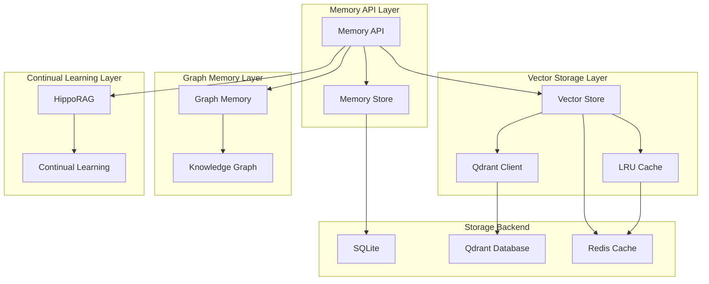

# Memory System Architecture

## Overview

The Ultimate Discord Intelligence Bot implements a sophisticated multi-layered memory system that combines vector storage, graph relationships, and continual learning to provide intelligent content retrieval and knowledge management. The system is designed for high-performance, tenant-isolated, and scalable memory operations.

## System Architecture



## Core Components

### 1. Memory API (`src/memory/api.py`)

**Purpose:** Unified facade for all memory operations

**Key Functions:**

- `store()`: Store content with vector embedding and metadata
- `retrieve()`: Retrieve content using semantic search and filtering
- Privacy filtering and tenant isolation
- Integration with learning engine and retention policies

**Implementation:**

```python
def store(
    store: MemoryStore,
    vstore: vector_store.VectorStore,
    *,
    tenant: str,
    workspace: str,
    text: str,
    item_type: str = "long",
    policy: str = "default",
) -> int:
    """Store text and metadata in both SQLite and vector store."""
    # Privacy filtering
    clean, _ = privacy_filter.filter_text(text, {"tenant": tenant})
    
    # Generate embedding
    vec = embeddings.embed([clean])[0]
    
    # Store in SQLite
    item = MemoryItem(
        id=None,
        tenant=tenant,
        workspace=workspace,
        text=clean,
        item_type=item_type,
        policy=policy,
        created_at=now,
        updated_at=now
    )
    item_id = store.store(item)
    
    # Store in vector store
    vstore.upsert_vectors(
        vectors=[vec],
        payloads=[{
            "id": item_id,
            "tenant": tenant,
            "workspace": workspace,
            "text": clean,
            "item_type": item_type,
            "policy": policy,
            "created_at": now
        }],
        tenant=tenant,
        workspace=workspace
    )
    
    return item_id
```

### 2. Vector Store (`src/memory/vector_store.py`)

**Purpose:** High-performance vector storage and similarity search

**Key Features:**

- **Qdrant Integration**: Production-grade vector database
- **LRU Caching**: Search result caching with TTL
- **Batch Operations**: Efficient bulk operations
- **Memory Compaction**: Deduplication and optimization
- **Tenant Isolation**: Complete namespace separation

#### 2.1 LRU Cache Implementation

**Purpose:** Cache search results to reduce database load

**Features:**

- **TTL Support**: Time-to-live for cache entries
- **LRU Eviction**: Least recently used eviction policy
- **Hit/Miss Tracking**: Performance metrics
- **Thread Safety**: Concurrent access support

**Implementation:**

```python
class LRUCache:
    def __init__(self, max_size: int = 1000, default_ttl: int = 300):
        self.max_size = max_size
        self.default_ttl = default_ttl
        self._cache: dict[str, tuple[Any, float, float]] = {}
        self._access_order: deque[str] = deque()
        self._hits = 0
        self._misses = 0
    
    def get(self, key: str) -> Any | None:
        """Get item from cache with LRU update."""
        if key not in self._cache:
            self._misses += 1
            return None
        
        value, timestamp, ttl = self._cache[key]
        current_time = time.time()
        
        # Check expiration
        if current_time - timestamp > ttl:
            del self._cache[key]
            self._misses += 1
            return None
        
        # Update access order
        self._access_order.remove(key)
        self._access_order.append(key)
        self._hits += 1
        return value
```

#### 2.2 Batch Operations

**Purpose:** Efficient bulk vector operations

**Features:**

- **Adaptive Batch Sizing**: Dynamic batch size based on vector dimensions
- **Parallel Execution**: Concurrent processing for search operations
- **Progress Tracking**: Real-time progress monitoring
- **Error Resilience**: Graceful handling of batch failures

**Implementation:**

```python
async def batch_upsert(
    self,
    vectors: list[list[float]],
    payloads: list[dict[str, Any]],
    tenant: str,
    workspace: str,
    batch_size: int | None = None,
) -> StepResult:
    """Batch upsert with adaptive sizing and performance tracking."""
    # Determine optimal batch size
    if batch_size is None:
        vector_dim = len(vectors[0]) if vectors else 768
        effective_batch_size = self._get_adaptive_batch_size(namespace, vector_dim)
    
    # Process in batches
    for offset in range(0, len(vectors), effective_batch_size):
        batch_vectors = vectors[offset:offset + effective_batch_size]
        batch_payloads = payloads[offset:offset + effective_batch_size]
        
        # Store batch
        self._store_batch(batch_points, physical)
        
        # Log progress
        if len(vectors) > 1000 and offset % (effective_batch_size * 10) == 0:
            progress = (offset / len(vectors)) * 100
            logger.info(f"Batch upsert progress: {progress:.1f}%")
```

#### 2.3 Memory Compaction

**Purpose:** Optimize storage by removing duplicate vectors

**Features:**

- **Cosine Similarity**: Mathematical similarity calculation
- **Batch Processing**: Memory-efficient duplicate detection
- **Cross-Batch Detection**: Find duplicates across different batches
- **Space Savings**: Automatic storage optimization

**Implementation:**

```python
async def compact_and_deduplicate(
    self,
    tenant: str,
    workspace: str,
    similarity_threshold: float | None = None,
) -> StepResult:
    """Compact memory by removing duplicate vectors."""
    # Fetch all vectors
    all_vectors = await self._fetch_all_vectors_for_compaction(physical, batch_size)
    
    # Find duplicates using cosine similarity
    duplicates = await self._find_duplicate_vectors(all_vectors, similarity_threshold)
    
    # Remove duplicates
    ids_to_remove = [dup["duplicate_id"] for dup in duplicates]
    deletion_result = await self.batch_delete(ids_to_remove, tenant, workspace)
    
    # Calculate space savings
    space_saved_percent = (len(ids_to_remove) / len(all_vectors)) * 100
    
    return StepResult(
        success=True,
        data={
            "vectors_analyzed": len(all_vectors),
            "duplicates_found": len(duplicates),
            "vectors_removed": len(ids_to_remove),
            "space_saved_percent": space_saved_percent
        }
    )
```

### 3. Memory Store (`src/memory/store.py`)

**Purpose:** SQLite-based metadata storage

**Key Features:**

- **Structured Storage**: Relational data storage
- **Tenant Isolation**: Complete data separation
- **Retention Policies**: Automated data lifecycle management
- **Transaction Support**: ACID compliance

**Schema:**

```sql
CREATE TABLE memory_items (
    id INTEGER PRIMARY KEY AUTOINCREMENT,
    tenant TEXT NOT NULL,
    workspace TEXT NOT NULL,
    text TEXT NOT NULL,
    item_type TEXT NOT NULL,
    policy TEXT NOT NULL,
    created_at TEXT NOT NULL,
    updated_at TEXT NOT NULL,
    metadata TEXT
);

CREATE INDEX idx_memory_items_tenant_workspace 
ON memory_items(tenant, workspace);

CREATE INDEX idx_memory_items_created_at 
ON memory_items(created_at);
```

### 4. Graph Memory (`src/memory/graph_memory.py`)

**Purpose:** Relationship-based knowledge storage

**Key Features:**

- **Entity Relationships**: Graph-based knowledge representation
- **Temporal Tracking**: Time-aware relationship evolution
- **Query Optimization**: Efficient graph traversal
- **Inference Support**: Relationship inference and reasoning

**Graph Structure:**

```python
class GraphMemory:
    def __init__(self):
        self.nodes: dict[str, dict] = {}  # Entity nodes
        self.edges: dict[str, dict] = {}  # Relationship edges
        self.temporal: dict[str, list] = {}  # Temporal relationships
    
    def add_relationship(
        self,
        source: str,
        target: str,
        relationship_type: str,
        confidence: float,
        timestamp: str
    ):
        """Add temporal relationship to graph."""
        edge_id = f"{source}->{target}:{relationship_type}"
        
        self.edges[edge_id] = {
            "source": source,
            "target": target,
            "type": relationship_type,
            "confidence": confidence,
            "created_at": timestamp
        }
        
        # Add temporal tracking
        if edge_id not in self.temporal:
            self.temporal[edge_id] = []
        self.temporal[edge_id].append({
            "confidence": confidence,
            "timestamp": timestamp
        })
```

### 5. HippoRAG Continual Memory (`src/memory/hipporag.py`)

**Purpose:** Continual learning and memory consolidation

**Key Features:**

- **Incremental Learning**: Continuous knowledge updates
- **Memory Consolidation**: Automatic knowledge integration
- **Forgetting Mechanisms**: Adaptive memory management
- **Pattern Recognition**: Long-term pattern learning

**Implementation:**

```python
class HippoRAGMemory:
    def __init__(self):
        self.memory_traces: dict[str, list] = {}
        self.consolidation_threshold = 0.8
        self.forgetting_threshold = 0.2
    
    async def update_memory(
        self,
        content: str,
        context: dict,
        importance: float
    ):
        """Update memory with new content."""
        # Create memory trace
        trace = {
            "content": content,
            "context": context,
            "importance": importance,
            "timestamp": time.time(),
            "access_count": 0
        }
        
        # Store trace
        trace_id = self._generate_trace_id(content, context)
        if trace_id not in self.memory_traces:
            self.memory_traces[trace_id] = []
        self.memory_traces[trace_id].append(trace)
        
        # Check for consolidation
        if len(self.memory_traces[trace_id]) > 3:
            await self._consolidate_memory(trace_id)
    
    async def _consolidate_memory(self, trace_id: str):
        """Consolidate related memory traces."""
        traces = self.memory_traces[trace_id]
        
        # Calculate consolidation score
        consolidation_score = sum(t["importance"] for t in traces) / len(traces)
        
        if consolidation_score > self.consolidation_threshold:
            # Consolidate into long-term memory
            consolidated = self._merge_traces(traces)
            await self._store_long_term_memory(consolidated)
            
            # Clear working memory
            self.memory_traces[trace_id] = []
```

## Caching Strategy

### Multi-Layer Caching

#### 1. Search Result Cache (LRU)

- **Purpose**: Cache vector search results
- **TTL**: 5 minutes (300 seconds)
- **Size**: 1000 entries
- **Eviction**: LRU policy

#### 2. Embedding Cache

- **Purpose**: Cache generated embeddings
- **TTL**: 1 hour (3600 seconds)
- **Size**: 10000 entries
- **Eviction**: LRU policy

#### 3. Metadata Cache

- **Purpose**: Cache frequently accessed metadata
- **TTL**: 30 minutes (1800 seconds)
- **Size**: 5000 entries
- **Eviction**: LRU policy

#### 4. Redis Cache (Optional)

- **Purpose**: Distributed caching for multi-instance deployments
- **TTL**: Configurable per cache type
- **Size**: Unlimited (Redis managed)
- **Eviction**: Redis policies

### Cache Performance Metrics

```python
@dataclass
class CacheMetrics:
    hits: int = 0
    misses: int = 0
    evictions: int = 0
    total_saved_cost: float = 0.0
    total_saved_latency_ms: float = 0.0
    
    @property
    def hit_rate(self) -> float:
        """Calculate cache hit rate."""
        total = self.hits + self.misses
        return self.hits / total if total > 0 else 0.0
```

## Tenant Isolation

### Namespace Strategy

**Vector Store Namespaces:**

```python
def _get_collection_name(self, tenant: str, workspace: str) -> str:
    """Generate tenant-isolated collection name."""
    return f"{tenant}_{workspace}_vectors"

def _get_physical_name(self, namespace: str) -> str:
    """Get physical collection name with tenant isolation."""
    return f"tenant_{namespace}"
```

**SQLite Database Isolation:**

```python
def get_database_path(self, tenant: str, workspace: str) -> str:
    """Get tenant-isolated database path."""
    return f"data/memory_{tenant}_{workspace}.db"
```

**Cache Key Isolation:**

```python
def _generate_cache_key(
    self,
    query_vector: list[float],
    limit: int,
    tenant: str,
    workspace: str,
    filters: dict | None = None
) -> str:
    """Generate tenant-isolated cache key."""
    vector_hash = hashlib.md5(
        json.dumps(query_vector[:10] + query_vector[-10:]).encode()
    ).hexdigest()[:8]
    
    filter_hash = hashlib.md5(
        json.dumps(filters or {}, sort_keys=True).encode()
    ).hexdigest()[:8]
    
    return f"{tenant}:{workspace}:{vector_hash}:{limit}:{filter_hash}"
```

## Performance Optimization

### Connection Pooling

**Qdrant Connection Pool:**

```python
class QdrantConnectionPool:
    def __init__(self, max_size: int = 10, timeout: float = 30.0):
        self.max_size = max_size
        self.timeout = timeout
        self._clients: dict[str, QdrantClient] = {}
        self._lock = threading.Lock()
    
    def get_client(self, url: str) -> QdrantClient:
        """Get or create pooled client for URL."""
        with self._lock:
            if url in self._clients:
                client = self._clients[url]
                if self._is_client_healthy(client):
                    return client
            
            # Create new client
            client = QdrantClient(
                url=url,
                timeout=self.timeout,
                prefer_grpc=True,
                grpc_port=6334
            )
            self._clients[url] = client
            return client
```

### Batch Processing

**Adaptive Batch Sizing:**

```python
def _get_adaptive_batch_size(self, namespace: str, vector_dim: int) -> int:
    """Get adaptive batch size based on vector dimension and performance."""
    base_batch_size = self._batch_size
    
    # Adjust based on vector dimension
    if vector_dim > LARGE_EMBEDDING_DIM:
        batch_size = min(base_batch_size // 2, SMALL_BATCH_SIZE)
    elif vector_dim > MEDIUM_EMBEDDING_DIM:
        batch_size = min(base_batch_size, MEDIUM_BATCH_SIZE)
    else:
        batch_size = base_batch_size
    
    # Adjust based on performance history
    recent_ops = list(self._performance_history)[-10:]
    if recent_ops:
        avg_duration = statistics.mean(op.duration_ms for op in recent_ops)
        if avg_duration > 1000:  # Slow operations
            batch_size = max(1, int(batch_size / ADAPTIVE_BATCH_FACTOR))
        elif avg_duration < 100:  # Fast operations
            batch_size = int(batch_size * ADAPTIVE_BATCH_FACTOR)
    
    return batch_size
```

### Memory Management

**Automatic Compaction:**

```python
async def _schedule_compaction(self, tenant: str, workspace: str):
    """Schedule memory compaction based on usage patterns."""
    namespace = f"{tenant}:{workspace}"
    
    # Check if compaction is needed
    collection_info = await self._get_collection_info(namespace)
    if collection_info.get("points_count", 0) > 10000:
        # Schedule compaction
        await self.compact_and_deduplicate(
            tenant=tenant,
            workspace=workspace,
            similarity_threshold=DEDUPLICATION_THRESHOLD
        )
```

## Monitoring and Observability

### Performance Metrics

**Vector Store Metrics:**

- **Search Latency**: Average search response time
- **Cache Hit Rate**: Percentage of cache hits
- **Batch Operation Performance**: Batch processing efficiency
- **Memory Usage**: Storage utilization and growth

**Memory System Metrics:**

- **Storage Operations**: Store/retrieve operation counts
- **Tenant Usage**: Per-tenant resource utilization
- **Compaction Efficiency**: Space savings from deduplication
- **Error Rates**: Operation failure rates

### Health Checks

**System Health Monitoring:**

```python
async def health_check(self) -> dict[str, Any]:
    """Comprehensive health check for memory system."""
    health_status = {
        "vector_store": await self._check_vector_store_health(),
        "memory_store": await self._check_memory_store_health(),
        "cache_system": await self._check_cache_health(),
        "tenant_isolation": await self._check_tenant_isolation(),
        "performance": await self._check_performance_health()
    }
    
    overall_health = all(
        status.get("healthy", False) 
        for status in health_status.values()
    )
    
    return {
        "overall_health": overall_health,
        "components": health_status,
        "timestamp": time.time()
    }
```

### Alerting

**Critical Alerts:**

- **Storage Failure**: Vector store or SQLite failures
- **Cache Degradation**: Low cache hit rates
- **Performance Issues**: High latency or low throughput
- **Tenant Isolation**: Cross-tenant data leakage

**Warning Alerts:**

- **Resource Pressure**: High memory or storage usage
- **Compaction Needed**: Storage optimization required
- **Performance Degradation**: Slower than expected operations
- **Cache Eviction**: High cache eviction rates

## Configuration

### Environment Variables

```bash
# Vector Store Configuration
QDRANT_URL=qdrant://localhost:6333
QDRANT_API_KEY=your_api_key
VECTOR_STORE_BATCH_SIZE=128
VECTOR_STORE_CACHE_SIZE=1000
VECTOR_STORE_CACHE_TTL=300

# Memory Store Configuration
MEMORY_STORE_PATH=data/memory.db
MEMORY_STORE_BACKUP_INTERVAL=3600
MEMORY_STORE_RETENTION_DAYS=365

# Cache Configuration
REDIS_URL=redis://localhost:6379
CACHE_ENABLED=true
CACHE_DEFAULT_TTL=300
CACHE_MAX_SIZE=10000

# Performance Configuration
MAX_CONCURRENT_OPERATIONS=10
BATCH_PROCESSING_ENABLED=true
COMPACTION_ENABLED=true
COMPACTION_THRESHOLD=0.98
```

### Content Type Configuration

```yaml
# config/memory.yaml
memory:
  vector_store:
    batch_size: 128
    cache_size: 1000
    cache_ttl: 300
    compaction_threshold: 0.98
    
  memory_store:
    backup_interval: 3600
    retention_days: 365
    max_items_per_tenant: 100000
    
  cache:
    enabled: true
    default_ttl: 300
    max_size: 10000
    redis_url: redis://localhost:6379
    
  performance:
    max_concurrent_operations: 10
    batch_processing_enabled: true
    compaction_enabled: true
```

## Security and Privacy

### Data Protection

**Privacy Filtering:**

```python
def store_with_privacy_filter(
    text: str,
    tenant: str,
    workspace: str
) -> tuple[str, dict]:
    """Store content with privacy filtering."""
    # Apply privacy filter
    clean_text, privacy_report = privacy_filter.filter_text(
        text, 
        {"tenant": tenant, "workspace": workspace}
    )
    
    # Store filtered content
    item_id = store(
        store=memory_store,
        vstore=vector_store,
        tenant=tenant,
        workspace=workspace,
        text=clean_text
    )
    
    return item_id, privacy_report
```

**Access Control:**

```python
def check_tenant_access(tenant: str, workspace: str, user_context: dict) -> bool:
    """Check if user has access to tenant/workspace."""
    user_tenant = user_context.get("tenant")
    user_workspace = user_context.get("workspace")
    
    return (
        user_tenant == tenant and 
        user_workspace == workspace
    )
```

### Data Retention

**Retention Policies:**

```python
class RetentionPolicy:
    def __init__(self, name: str, days: int, auto_delete: bool = True):
        self.name = name
        self.days = days
        self.auto_delete = auto_delete
    
    def should_retain(self, created_at: str) -> bool:
        """Check if item should be retained."""
        created_date = datetime.fromisoformat(created_at)
        age_days = (datetime.now() - created_date).days
        return age_days <= self.days

# Default policies
DEFAULT_POLICIES = {
    "default": RetentionPolicy("default", 365, True),
    "long_term": RetentionPolicy("long_term", 1095, False),  # 3 years
    "short_term": RetentionPolicy("short_term", 30, True),   # 30 days
    "permanent": RetentionPolicy("permanent", 999999, False) # Never delete
}
```

## Future Enhancements

### Planned Improvements

#### Performance Optimizations

- **GPU Acceleration**: GPU-based vector operations
- **Distributed Caching**: Multi-node cache distribution
- **Streaming Processing**: Real-time memory updates
- **Predictive Caching**: ML-based cache optimization

#### Feature Enhancements

- **Multi-Modal Memory**: Image and audio memory support
- **Temporal Queries**: Time-based memory queries
- **Relationship Inference**: Automatic relationship discovery
- **Memory Visualization**: Interactive memory exploration

#### Scalability Improvements

- **Horizontal Scaling**: Multi-instance memory distribution
- **Federated Learning**: Cross-tenant knowledge sharing
- **Edge Computing**: Distributed memory processing
- **Auto-Scaling**: Dynamic resource allocation

### Research Areas

#### Advanced Memory Models

- **Episodic Memory**: Event-based memory storage
- **Semantic Memory**: Concept-based memory organization
- **Procedural Memory**: Process-based memory storage
- **Working Memory**: Short-term memory management

#### AI/ML Integration

- **Memory Compression**: Intelligent memory compression
- **Pattern Recognition**: Long-term pattern learning
- **Memory Prediction**: Predictive memory management
- **Adaptive Forgetting**: Intelligent memory forgetting
