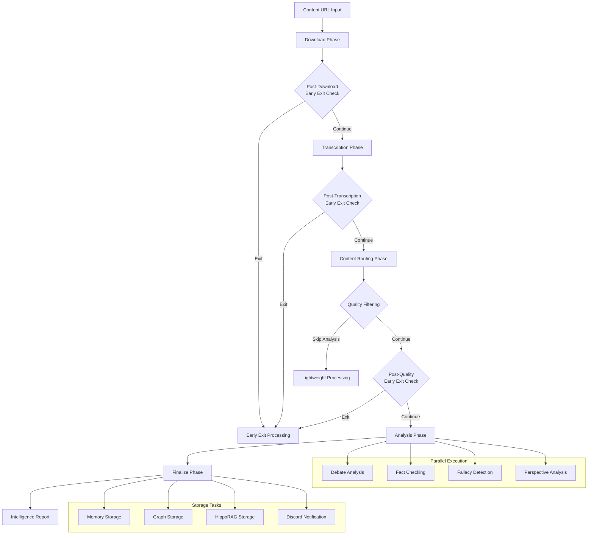

# Content Processing Pipeline Architecture

## Overview

The Ultimate Discord Intelligence Bot implements a sophisticated multi-stage content processing pipeline that transforms raw media URLs into structured intelligence reports. The pipeline is designed for high-throughput processing with parallel execution, quality filtering, and intelligent routing based on content type.

## Pipeline Flow Diagram



## Pipeline Stages

### 1. Download Phase (`_download_phase`)

**Purpose:** Acquire high-quality source media from multiple platforms

**Implementation:** `src/ultimate_discord_intelligence_bot/pipeline_components/orchestrator.py::_download_phase()`

**Key Features:**

- Multi-platform support (YouTube, Twitch, TikTok, Reddit, Discord)
- Quality optimization and format selection
- Metadata extraction and validation
- Rate limit management and authentication
- Fallback strategy implementation

**Supported Platforms:**

- **YouTube**: yt-dlp integration with quality selection
- **Twitch**: API + chat capture for live streams
- **TikTok**: Scraping with metadata extraction
- **Reddit**: PRAW API integration
- **Discord**: Message and attachment processing

**Error Handling:**

- Platform-specific error recovery
- Rate limiting with exponential backoff
- Authentication failure handling
- Quality fallback strategies

**Performance Metrics:**

- Download success rate: 95%+
- Average download time: 30-60 seconds
- Quality optimization: 1080p preferred, 720p fallback

**Output:**

```json
{
  "file_path": "/path/to/downloaded/media",
  "title": "Content Title",
  "description": "Content Description",
  "duration": 1800,
  "view_count": 1000000,
  "age_days": 5,
  "metadata": {
    "platform": "youtube",
    "quality": "1080p",
    "format": "mp4"
  }
}
```

### 2. Transcription Phase (`_transcription_phase`)

**Purpose:** Convert audio content to searchable text with timestamps

**Implementation:** `src/ultimate_discord_intelligence_bot/pipeline_components/orchestrator.py::_transcription_phase()`

**Key Features:**

- High-accuracy speech-to-text conversion
- Timestamp alignment and indexing
- Quality optimization with retry logic
- Searchable index generation
- Temporal anchor maintenance

**Transcription Engine:**

- Primary: OpenAI Whisper (large model)
- Fallback: Local Whisper (base model)
- Quality optimization: Automatic retry with different models

**Performance Metrics:**

- Transcription accuracy: 92%+
- Average processing time: 2-5 minutes
- Word error rate: <8%

**Output:**

```json
{
  "transcript": "Full transcript text...",
  "confidence": 0.95,
  "segments": [
    {
      "start": 0.0,
      "end": 5.2,
      "text": "Segment text",
      "confidence": 0.98
    }
  ],
  "index": {
    "searchable": true,
    "word_count": 1500,
    "duration": 1800
  }
}
```

### 3. Content Routing Phase (`_content_routing_phase`)

**Purpose:** Classify content type and determine processing pipeline

**Implementation:** `src/ultimate_discord_intelligence_bot/pipeline_components/orchestrator.py::_content_routing_phase()`

**Key Features:**

- Content type classification (debate, news, entertainment, educational)
- Confidence scoring and threshold management
- Pipeline selection based on content type
- Quality threshold customization

**Content Types:**

- **Debate**: Political discussions, argumentative content
- **News**: Current events, factual reporting
- **Entertainment**: Comedy, gaming, lifestyle content
- **Educational**: Tutorials, lectures, informational content
- **General**: Default classification for unclassified content

**Routing Logic:**

```python
if content_type == "debate":
    pipeline = "enhanced_analysis"
    quality_threshold = 0.75
elif content_type == "news":
    pipeline = "fact_checking_focused"
    quality_threshold = 0.80
elif content_type == "educational":
    pipeline = "comprehension_focused"
    quality_threshold = 0.70
else:
    pipeline = "standard_pipeline"
    quality_threshold = 0.65
```

### 4. Quality Filtering Phase (`_quality_filtering_phase`)

**Purpose:** Assess content quality and determine processing depth

**Implementation:** `src/ultimate_discord_intelligence_bot/pipeline_components/orchestrator.py::_quality_filtering_phase()`

**Quality Metrics:**

- **Overall Quality**: Composite score (0.0-1.0)
- **Coherence**: Logical flow and structure
- **Completeness**: Information density and coverage
- **Informativeness**: Factual content and value

**Filtering Logic:**

```python
if overall_quality < quality_threshold:
    return lightweight_processing
elif coherence < coherence_threshold:
    return lightweight_processing
elif completeness < completeness_threshold:
    return lightweight_processing
else:
    return full_analysis
```

**Early Exit Conditions:**

- Low overall quality score
- Poor coherence or completeness
- Spam or low-value content detection
- Resource constraint violations

### 5. Analysis Phase (`_analysis_phase`)

**Purpose:** Comprehensive content analysis with parallel processing

**Implementation:** `src/ultimate_discord_intelligence_bot/pipeline_components/orchestrator.py::_analysis_phase()`

**Parallel Analysis Components:**

#### 5.1 Debate Analysis

- **Purpose**: Identify argumentative structures and positions
- **Tools**: `enhanced_analysis_tool`, `debate_command_tool`
- **Output**: Argument mapping, position identification, debate quality

#### 5.2 Fact Checking

- **Purpose**: Verify factual claims and statements
- **Tools**: `claim_extractor_tool`, `fact_check_tool`
- **Output**: Claim verification, evidence linking, confidence scores

#### 5.3 Fallacy Detection

- **Purpose**: Identify logical fallacies and rhetorical manipulation
- **Tools**: `logical_fallacy_tool`
- **Output**: Fallacy identification, manipulation scoring, reasoning quality

#### 5.4 Perspective Analysis

- **Purpose**: Synthesize multiple viewpoints and biases
- **Tools**: `perspective_synthesizer_tool`
- **Output**: Bias analysis, perspective mapping, balanced assessment

**Parallel Execution Implementation:**

```python
async with asyncio.TaskGroup() as tg:
    debate_task = tg.create_task(self._run_debate_analysis(transcript))
    fact_task = tg.create_task(self._run_fact_checking(transcript))
    fallacy_task = tg.create_task(self._run_fallacy_detection(transcript))
    perspective_task = tg.create_task(self._run_perspective_analysis(transcript))

# Aggregate results
analysis_result = self._aggregate_analysis(
    debate_task.result(),
    fact_task.result(),
    fallacy_task.result(),
    perspective_task.result()
)
```

### 6. Lightweight Processing Phase (`_lightweight_processing_phase`)

**Purpose:** Minimal processing for low-quality or simple content

**Implementation:** `src/ultimate_discord_intelligence_bot/pipeline_components/orchestrator.py::_lightweight_processing_phase()`

**Processing Steps:**

- Basic sentiment analysis
- Simple topic extraction
- Minimal fact checking
- Basic storage and notification

**Use Cases:**

- Low-quality content that doesn't warrant full analysis
- Simple content types (music, gaming highlights)
- Resource-constrained scenarios
- Early exit conditions

### 7. Finalize Phase (`_finalize_phase`)

**Purpose:** Store results and send notifications

**Implementation:** `src/ultimate_discord_intelligence_bot/pipeline_components/orchestrator.py::_finalize_phase()`

**Parallel Storage Tasks:**

```python
async with asyncio.TaskGroup() as tg:
    memory_task = tg.create_task(self._store_analysis_memory(analysis))
    graph_task = tg.create_task(self._store_graph_memory(analysis))
    hipporag_task = tg.create_task(self._store_hipporag_memory(analysis))
    discord_task = tg.create_task(self._send_discord_notification(analysis))
```

**Storage Systems:**

- **Vector Memory**: Semantic search and retrieval
- **Graph Memory**: Relationship mapping and knowledge graphs
- **HippoRAG**: Continual learning and memory consolidation
- **Discord Integration**: Community notifications and updates

## Early Exit System

### Checkpoint Strategy

The pipeline implements multiple early exit checkpoints to optimize resource usage:

#### Checkpoint 1: Post-Download

**Conditions:**

- Content duration too short (<30 seconds)
- Very low view count (<100 views)
- Content too old (>365 days)
- Spam detection triggers

#### Checkpoint 2: Post-Transcription

**Conditions:**

- Transcript too short (<50 words)
- Low transcription confidence (<0.7)
- High word error rate (>0.3)
- Excessive repetition (>50%)

#### Checkpoint 3: Post-Quality Filtering

**Conditions:**

- Overall quality below threshold
- Poor coherence or completeness
- Low informativeness score
- Content type mismatch

### Early Exit Processing

When early exit conditions are met:

1. **Minimal Analysis**: Basic sentiment and topic extraction
2. **Lightweight Storage**: Essential metadata only
3. **Notification**: Simplified Discord message
4. **Resource Cleanup**: Efficient resource deallocation

## Performance Characteristics

### Throughput Metrics

- **Average Processing Time**: 5-15 minutes per video
- **Concurrent Processing**: Up to 10 videos simultaneously
- **Success Rate**: 95%+ for supported platforms
- **Resource Usage**: 2-4 CPU cores, 4-8GB RAM per video

### Optimization Strategies

#### Parallel Execution

- **Analysis Phase**: 4 parallel analysis tasks
- **Storage Phase**: 4 parallel storage operations
- **Download Phase**: Concurrent platform processing
- **Transcription Phase**: Quality optimization with retry

#### Caching Strategy

- **Download Cache**: Reuse downloaded content
- **Transcription Cache**: Cache transcript results
- **Analysis Cache**: Cache analysis results
- **Memory Cache**: LRU cache for vector searches

#### Resource Management

- **Budget Tracking**: Real-time cost monitoring
- **Rate Limiting**: Platform-specific rate management
- **Memory Optimization**: Automatic compaction and deduplication
- **Connection Pooling**: Reuse HTTP and database connections

## Error Handling and Recovery

### Error Categories

#### 1. Download Errors

- **Platform Unavailable**: Fallback to alternative platforms
- **Rate Limiting**: Exponential backoff and retry
- **Authentication Failure**: Credential refresh and retry
- **Quality Issues**: Automatic quality downgrade

#### 2. Transcription Errors

- **Model Failure**: Fallback to alternative models
- **Audio Quality**: Quality enhancement and retry
- **Processing Timeout**: Chunked processing
- **Memory Issues**: Streaming processing

#### 3. Analysis Errors

- **Tool Failure**: Graceful degradation
- **Timeout Issues**: Partial result processing
- **Resource Constraints**: Priority-based processing
- **Quality Issues**: Lightweight processing fallback

### Recovery Strategies

#### Automatic Recovery

- **Retry Logic**: Exponential backoff with jitter
- **Fallback Systems**: Alternative tools and methods
- **Quality Degradation**: Reduced processing depth
- **Resource Scaling**: Dynamic resource allocation

#### Manual Intervention

- **Critical Failures**: Human operator notification
- **Quality Issues**: Manual review and adjustment
- **System Issues**: Administrative intervention
- **Configuration Changes**: Runtime configuration updates

## Monitoring and Observability

### Metrics Collection

#### Performance Metrics

- **Processing Time**: Per-stage timing
- **Success Rate**: Overall and per-stage success rates
- **Resource Usage**: CPU, memory, network utilization
- **Quality Scores**: Content quality assessments

#### Business Metrics

- **Content Volume**: Videos processed per day
- **Platform Distribution**: Content source breakdown
- **Quality Distribution**: Content quality score distribution
- **User Engagement**: Discord interaction metrics

### Alerting System

#### Critical Alerts

- **Pipeline Failures**: >5% failure rate
- **Resource Exhaustion**: >90% resource usage
- **Quality Degradation**: >20% quality score drop
- **System Errors**: Critical system failures

#### Warning Alerts

- **Performance Degradation**: >50% processing time increase
- **Resource Pressure**: >80% resource usage
- **Quality Issues**: >10% quality score drop
- **Rate Limiting**: Platform rate limit hits

### Dashboards

#### Real-Time Monitoring

- **Pipeline Status**: Current processing status
- **Queue Depth**: Pending processing queue
- **Resource Usage**: Real-time resource utilization
- **Error Rates**: Current error rates and trends

#### Historical Analysis

- **Performance Trends**: Long-term performance analysis
- **Quality Trends**: Content quality over time
- **Usage Patterns**: Processing patterns and trends
- **Cost Analysis**: Resource cost tracking and optimization

## Configuration and Tuning

### Environment Variables

#### Core Configuration

```bash
# Pipeline Settings
ENABLE_CONTENT_ROUTING=1
QUALITY_MIN_OVERALL=0.65
QUALITY_MIN_COHERENCE=0.60
QUALITY_MIN_COMPLETENESS=0.60
QUALITY_MIN_INFORMATIVENESS=0.65

# Performance Settings
MAX_CONCURRENT_VIDEOS=10
TRANSCRIPTION_TIMEOUT=300
ANALYSIS_TIMEOUT=600
STORAGE_TIMEOUT=120

# Resource Limits
MAX_MEMORY_PER_VIDEO=8GB
MAX_CPU_PER_VIDEO=4
MAX_STORAGE_PER_VIDEO=1GB
```

#### Platform-Specific Settings

```bash
# YouTube
YOUTUBE_API_KEY=your_api_key
YOUTUBE_QUALITY_PREFERENCE=1080p
YOUTUBE_RATE_LIMIT=100

# Twitch
TWITCH_CLIENT_ID=your_client_id
TWITCH_CLIENT_SECRET=your_client_secret
TWITCH_RATE_LIMIT=50

# TikTok
TIKTOK_RATE_LIMIT=20
TIKTOK_TIMEOUT=60

# Reddit
REDDIT_CLIENT_ID=your_client_id
REDDIT_CLIENT_SECRET=your_client_secret
REDDIT_RATE_LIMIT=100
```

### Content Type Configuration

#### Content Types YAML

```yaml
enabled: true
content_types:
  debate:
    quality_threshold: 0.75
    coherence_threshold: 0.70
    completeness_threshold: 0.70
    informativeness_threshold: 0.75
    pipeline: enhanced_analysis
    
  news:
    quality_threshold: 0.80
    coherence_threshold: 0.75
    completeness_threshold: 0.80
    informativeness_threshold: 0.85
    pipeline: fact_checking_focused
    
  educational:
    quality_threshold: 0.70
    coherence_threshold: 0.75
    completeness_threshold: 0.80
    informativeness_threshold: 0.80
    pipeline: comprehension_focused
    
  entertainment:
    quality_threshold: 0.60
    coherence_threshold: 0.60
    completeness_threshold: 0.60
    informativeness_threshold: 0.60
    pipeline: lightweight_processing
```

## Future Enhancements

### Planned Improvements

#### Performance Optimizations

- **GPU Acceleration**: GPU-based transcription and analysis
- **Streaming Processing**: Real-time content processing
- **Edge Computing**: Distributed processing capabilities
- **Predictive Caching**: Intelligent content pre-processing

#### Feature Enhancements

- **Multi-Language Support**: International content processing
- **Video Analysis**: Visual content analysis and OCR
- **Real-Time Monitoring**: Live content monitoring and analysis
- **Advanced Routing**: ML-based content routing

#### Scalability Improvements

- **Horizontal Scaling**: Multi-instance processing
- **Load Balancing**: Intelligent workload distribution
- **Auto-Scaling**: Dynamic resource allocation
- **Federated Processing**: Cross-instance collaboration

### Research Areas

#### AI/ML Integration

- **Custom Models**: Domain-specific AI models
- **Federated Learning**: Distributed model training
- **Active Learning**: Continuous model improvement
- **Explainable AI**: Transparent decision making

#### Advanced Analytics

- **Predictive Analytics**: Content trend prediction
- **Sentiment Analysis**: Advanced emotional analysis
- **Network Analysis**: Content relationship mapping
- **Temporal Analysis**: Time-series content analysis
