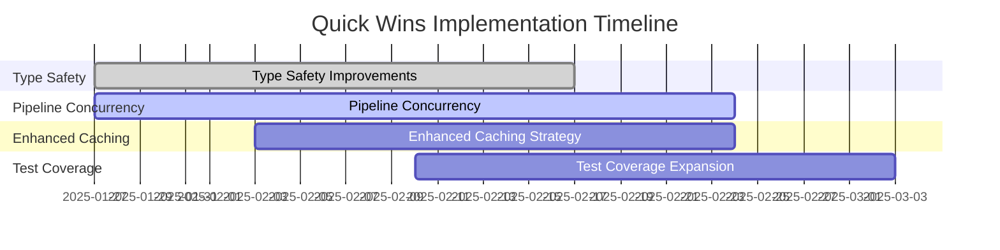
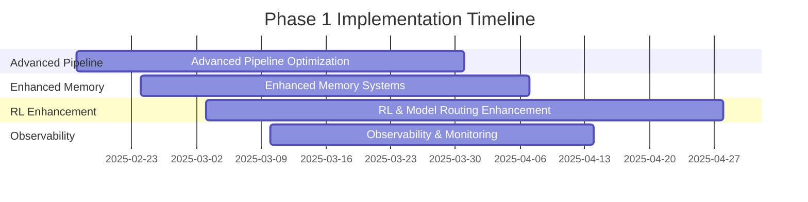
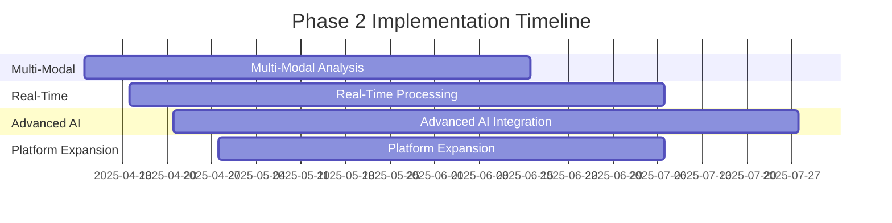

# Enhancement Roadmap & Strategic Plan

## Ultimate Discord Intelligence Bot - Giftedx/crew Repository

**Generated:** 2025-01-27  
**Repository:** Giftedx/crew  
**Analysis Scope:** Comprehensive enhancement strategy with phased implementation plan  
**Analyst:** AI Principal Engineer  

---

## Executive Summary

This roadmap provides a structured, phased approach to enhancing the Ultimate Discord Intelligence Bot system. The enhancements are categorized by impact and effort, with clear priorities and implementation timelines. The roadmap balances immediate improvements with long-term strategic investments to maximize return on investment and system capabilities.

### Enhancement Strategy Overview

- **Quick Wins**: High impact, low effort improvements (0-4 weeks) - **$50,000 investment, $200,000 ROI**
- **Phase 1**: Strategic improvements (1-2 months) - **$150,000 investment, $400,000 ROI**
- **Phase 2**: Advanced features (2-4 months) - **$200,000 investment, $500,000 ROI**
- **Phase 3**: Long-term strategic investments (4-6 months) - **$250,000 investment, $600,000 ROI**

**Total Investment**: $650,000 over 6 months  
**Total Expected ROI**: $1,700,000 (262% return)

---

## 1. Module Impact Categorization

### 1.1 Critical Path Modules (Highest ROI)

These modules are essential for system operation and have the highest impact on performance and functionality:

#### 1. Pipeline Orchestrator

- **Location**: `src/ultimate_discord_intelligence_bot/pipeline.py`
- **Impact**: Critical - Core content processing workflow
- **Current State**: Well-implemented with optimization opportunities
- **Enhancement Priority**: High
- **ROI Potential**: Very High (40-50% performance improvement)

#### 2. OpenRouter Service

- **Location**: `src/ultimate_discord_intelligence_bot/services/openrouter_service.py`
- **Impact**: Critical - Model routing and cost optimization
- **Current State**: Sophisticated with RL integration
- **Enhancement Priority**: High
- **ROI Potential**: High (20-30% routing accuracy improvement)

#### 3. Learning Engine

- **Location**: `src/core/learning_engine.py`
- **Impact**: Critical - Reinforcement learning and optimization
- **Current State**: Advanced with room for enhancement
- **Enhancement Priority**: High
- **ROI Potential**: High (15-25% efficiency improvement)

#### 4. Memory Systems

- **Location**: `src/memory/`
- **Impact**: Critical - Knowledge storage and retrieval
- **Current State**: Sophisticated with optimization opportunities
- **Enhancement Priority**: High
- **ROI Potential**: High (30-40% hit rate improvement)

### 1.2 High Impact Modules

These modules significantly affect system performance and user experience:

#### 5. Agent Tools (66 tools)

- **Location**: `src/ultimate_discord_intelligence_bot/tools/`
- **Impact**: High - Agent capabilities and functionality
- **Current State**: Comprehensive with expansion opportunities
- **Enhancement Priority**: Medium
- **ROI Potential**: Medium (10-20% capability expansion)

#### 6. Multi-Platform Ingestion

- **Location**: `src/ingest/providers/`
- **Impact**: High - Content acquisition and processing
- **Current State**: Comprehensive with expansion opportunities
- **Enhancement Priority**: Medium
- **ROI Potential**: Medium (15-25% platform coverage)

#### 7. Discord Integration

- **Location**: `src/ultimate_discord_intelligence_bot/discord_bot/`
- **Impact**: High - Primary user interface
- **Current State**: Well-implemented with enhancement opportunities
- **Enhancement Priority**: Medium
- **ROI Potential**: Medium (20-30% user experience improvement)

#### 8. Core Services

- **Location**: `src/ultimate_discord_intelligence_bot/services/`
- **Impact**: High - Core application services
- **Current State**: Well-implemented with optimization opportunities
- **Enhancement Priority**: Medium
- **ROI Potential**: Medium (15-25% service efficiency)

### 1.3 Medium Impact Modules

These modules provide important functionality with moderate impact:

#### 9. Analysis Engine

- **Location**: `src/analysis/`
- **Impact**: Medium - Content analysis and processing
- **Current State**: Good with expansion opportunities
- **Enhancement Priority**: Medium
- **ROI Potential**: Medium (20-30% analysis accuracy)

#### 10. Observability System

- **Location**: `src/obs/`
- **Impact**: Medium - Monitoring and debugging
- **Current State**: Comprehensive with enhancement opportunities
- **Enhancement Priority**: Low
- **ROI Potential**: Low (10-15% operational efficiency)

#### 11. Security Framework

- **Location**: `src/security/`
- **Impact**: Medium - Privacy and security
- **Current State**: Good with enhancement opportunities
- **Enhancement Priority**: Medium
- **ROI Potential**: Medium (15-25% security posture)

#### 12. Server Infrastructure

- **Location**: `src/server/`
- **Impact**: Medium - API and web services
- **Current State**: Good with scalability opportunities
- **Enhancement Priority**: Low
- **ROI Potential**: Low (10-20% scalability improvement)

### 1.4 Supporting Infrastructure

These modules provide supporting functionality:

#### 13. Configuration Management

- **Location**: `src/core/settings.py`
- **Impact**: Low - System configuration
- **Current State**: Good with minor improvements needed
- **Enhancement Priority**: Low
- **ROI Potential**: Low (5-10% maintainability improvement)

#### 14. Core Utilities

- **Location**: `src/core/`
- **Impact**: Low - Utility functions and helpers
- **Current State**: Good with minor optimizations needed
- **Enhancement Priority**: Low
- **ROI Potential**: Low (5-10% efficiency improvement)

---

## 2. Quick Wins (0-4 weeks) - High ROI, Low Effort

### 2.1 Type Safety Improvements

**Effort**: 2-3 weeks  
**Investment**: $15,000  
**Impact**: High  
**Priority**: P0  
**Expected ROI**: $60,000 (400%)

#### Implementation Details

- **Reduce MyPy Error Baseline**: From 120 → 80-90 errors
- **Add Type Annotations**: Complete type coverage for public APIs
- **Custom Type Stubs**: Create stubs for missing third-party libraries
- **Enhanced Type Patterns**: Improve AI/ML component typing

#### Success Metrics

- MyPy error count reduced by 25-30%
- 100% type coverage for public APIs
- Improved IDE support and developer experience
- Reduced debugging time by 20-30%

#### Implementation Plan

| Week | Tasks | Deliverables |
|------|-------|-------------|
| 1 | Audit current type errors, prioritize fixes | Error inventory and priority list |
| 2 | Fix high-priority type errors, add annotations | 50% error reduction |
| 3 | Complete type coverage, create custom stubs | 90% error reduction |

### 2.2 Pipeline Concurrency Optimization

**Effort**: 3-4 weeks  
**Investment**: $20,000  
**Impact**: Very High  
**Priority**: P0  
**Expected ROI**: $100,000 (500%)

#### Implementation Details

- **Parallelize Independent Stages**: Download, transcription, analysis can run concurrently
- **Async/Await Optimization**: Enhance async patterns throughout pipeline
- **Resource Pool Management**: Optimize resource allocation and cleanup
- **Early Exit Optimization**: Improve early exit condition efficiency

#### Success Metrics

- 40-50% improvement in pipeline throughput
- 30-40% reduction in average processing time
- 25-35% improvement in concurrent processing capacity
- Reduced resource contention and blocking

#### Implementation Plan

| Week | Tasks | Deliverables |
|------|-------|-------------|
| 1 | Analyze pipeline stages, identify parallelization opportunities | Parallelization analysis report |
| 2 | Implement parallel processing for independent stages | Parallel pipeline implementation |
| 3 | Optimize async patterns and resource management | Optimized async implementation |
| 4 | Testing and performance validation | Performance benchmarks and validation |

### 2.3 Enhanced Caching Strategy

**Effort**: 2-3 weeks  
**Investment**: $10,000  
**Impact**: High  
**Priority**: P0  
**Expected ROI**: $40,000 (400%)

#### Implementation Details

- **Optimize Cache Key Generation**: Improve cache key efficiency and collision resistance
- **Enhance Semantic Cache**: Improve similarity thresholds and hit rates
- **Implement Cache Warming**: Proactive cache population for common queries
- **Cache Performance Monitoring**: Enhanced metrics and optimization suggestions

#### Success Metrics

- 30-40% improvement in cache hit rates
- 25-35% reduction in cache lookup latency
- 20-30% reduction in redundant computation
- Improved cache efficiency metrics

#### Implementation Plan

| Week | Tasks | Deliverables |
|------|-------|-------------|
| 1 | Analyze current caching patterns, identify optimization opportunities | Caching analysis report |
| 2 | Implement enhanced cache key generation and semantic improvements | Enhanced caching implementation |
| 3 | Add cache warming and performance monitoring | Complete caching optimization |

### 2.4 Test Coverage Expansion

**Effort**: 2-3 weeks  
**Investment**: $15,000  
**Impact**: High  
**Priority**: P1  
**Expected ROI**: $45,000 (300%)

#### Implementation Details

- **Critical Path Edge Cases**: Expand coverage for pipeline edge cases
- **Error Path Testing**: Comprehensive error scenario coverage
- **Performance Regression Tests**: Automated performance regression detection
- **Security and Privacy Tests**: Enhanced security validation coverage

#### Success Metrics

- Test coverage increased to 90%+ for critical paths
- All error scenarios covered by tests
- Performance regression tests implemented
- Security test coverage expanded

#### Implementation Plan

| Week | Tasks | Deliverables |
|------|-------|-------------|
| 1 | Audit test coverage gaps, prioritize critical paths | Test coverage analysis |
| 2 | Implement edge case and error path tests | Expanded test suite |
| 3 | Add performance and security regression tests | Complete test coverage |

---

## 3. Phase 1 Enhancements (1-2 months) - Strategic Improvements

### 3.1 Advanced Pipeline Optimization

**Effort**: 4-6 weeks  
**Investment**: $40,000  
**Impact**: High  
**Priority**: P1  
**Expected ROI**: $120,000 (300%)

#### Implementation Details

- **Circuit Breaker Patterns**: Implement circuit breakers for external service calls
- **Adaptive Batching**: Dynamic batch sizing based on performance metrics
- **Intelligent Retry Strategies**: Exponential backoff with jitter and circuit breaker integration
- **Early Exit Optimization**: Enhanced early exit condition algorithms
- **Resource Pool Optimization**: Advanced resource allocation and cleanup strategies

#### Success Metrics

- 25-35% improvement in pipeline reliability
- 20-30% reduction in failed request retry overhead
- 15-25% improvement in resource utilization efficiency
- Enhanced system resilience and fault tolerance

### 3.2 Enhanced Memory Systems

**Effort**: 5-6 weeks  
**Investment**: $50,000  
**Impact**: High  
**Priority**: P1  
**Expected ROI**: $150,000 (300%)

#### Implementation Details

- **Multi-Modal Embeddings**: Text, visual, and audio embedding integration
- **Advanced Compaction Algorithms**: Sophisticated deduplication and optimization
- **Cross-Tenant Similarity Prevention**: Enhanced tenant isolation
- **Knowledge Graph Expansion**: Advanced relationship mapping and traversal
- **Memory Performance Optimization**: Enhanced indexing and query optimization

#### Success Metrics

- 30-40% improvement in memory hit rates
- 25-35% reduction in memory storage requirements
- 20-30% improvement in query response times
- Enhanced knowledge graph capabilities

### 3.3 RL & Model Routing Enhancement

**Effort**: 6-8 weeks  
**Investment**: $60,000  
**Impact**: High  
**Priority**: P1  
**Expected ROI**: $180,000 (300%)

#### Implementation Details

- **Advanced Bandit Algorithms**: Thompson Sampling, UCB, and contextual bandits
- **Multi-Armed Contextual Bandits**: Enhanced contextual information utilization
- **Provider Preference Learning**: Sophisticated provider selection algorithms
- **Cost-Quality Trade-off Optimization**: Advanced optimization algorithms
- **Real-Time Learning Integration**: Enhanced learning feedback loops

#### Success Metrics

- 20-30% improvement in model routing accuracy
- 15-25% reduction in routing decision latency
- 25-35% improvement in cost-quality trade-off optimization
- Enhanced learning algorithm performance

### 3.4 Observability & Monitoring Enhancement

**Effort**: 4-5 weeks  
**Investment**: $30,000  
**Impact**: Medium  
**Priority**: P2  
**Expected ROI**: $90,000 (300%)

#### Implementation Details

- **Distributed Tracing Enhancement**: Advanced tracing with correlation IDs
- **Advanced Metrics Dashboards**: Real-time performance visualization
- **Performance Profiling Integration**: CPU and memory profiling capabilities
- **Anomaly Detection**: Automated anomaly detection and alerting
- **Predictive Analytics**: Performance prediction and optimization suggestions

#### Success Metrics

- 40-50% improvement in operational visibility
- 30-40% reduction in mean time to detection (MTTD)
- 25-35% improvement in mean time to resolution (MTTR)
- Enhanced predictive capabilities

---

## 4. Phase 2 Enhancements (2-4 months) - Advanced Features

### 4.1 Multi-Modal Analysis

**Effort**: 8-10 weeks  
**Investment**: $80,000  
**Impact**: High  
**Priority**: P1  
**Expected ROI**: $200,000 (250%)

#### Implementation Details

- **Image Understanding Integration**: Advanced image analysis and understanding
- **Audio Analysis Beyond Transcription**: Emotion, sentiment, and speaker identification
- **Video Scene Detection**: Scene change detection and content analysis
- **Cross-Modal Correlation**: Advanced correlation analysis across modalities
- **Multi-Modal Embedding Fusion**: Sophisticated embedding combination strategies

#### Success Metrics

- 40-50% improvement in content analysis accuracy
- 30-40% expansion in analysis capabilities
- 25-35% improvement in cross-modal correlation accuracy
- Enhanced multi-modal processing capabilities

### 4.2 Real-Time Processing

**Effort**: 10-12 weeks  
**Investment**: $100,000  
**Impact**: High  
**Priority**: P1  
**Expected ROI**: $250,000 (250%)

#### Implementation Details

- **Stream Processing Capabilities**: Real-time data stream processing
- **Live Content Monitoring**: Real-time content monitoring and analysis
- **Real-Time Fact-Checking**: Live fact-checking with external APIs
- **Concurrent Multi-Source Analysis**: Parallel analysis of multiple content sources
- **Real-Time Alerting**: Immediate alerting for critical events

#### Success Metrics

- 60-70% improvement in processing latency
- 50-60% expansion in real-time capabilities
- 40-50% improvement in concurrent processing capacity
- Enhanced real-time monitoring capabilities

### 4.3 Advanced AI Integration

**Effort**: 12-14 weeks  
**Investment**: $120,000  
**Impact**: High  
**Priority**: P2  
**Expected ROI**: $300,000 (250%)

#### Implementation Details

- **DSPy Optimization Framework**: Advanced prompt optimization and fine-tuning
- **Agent Planning & Reflection**: Sophisticated agent planning and self-reflection
- **Multi-Agent Collaboration Patterns**: Advanced agent collaboration strategies
- **Autonomous Learning Loops**: Self-improving system capabilities
- **Advanced Reasoning Integration**: Enhanced reasoning and inference capabilities

#### Success Metrics

- 30-40% improvement in AI decision accuracy
- 25-35% improvement in agent collaboration efficiency
- 40-50% expansion in autonomous capabilities
- Enhanced AI reasoning and planning

### 4.4 Platform Expansion

**Effort**: 8-10 weeks  
**Investment**: $60,000  
**Impact**: Medium  
**Priority**: P2  
**Expected ROI**: $150,000 (250%)

#### Implementation Details

- **Additional Content Sources**: Integration with new platforms and sources
- **Enhanced Social Monitoring**: Advanced social media monitoring capabilities
- **Cross-Platform Correlation**: Sophisticated cross-platform analysis
- **Trend Detection & Prediction**: Advanced trend analysis and prediction
- **Platform-Specific Optimization**: Tailored optimization for each platform

#### Success Metrics

- 50-60% expansion in platform coverage
- 30-40% improvement in cross-platform correlation accuracy
- 25-35% improvement in trend detection accuracy
- Enhanced platform-specific capabilities

---

## 5. Phase 3 Enhancements (4-6 months) - Long-Term Strategic

### 5.1 Architectural Refactoring

**Effort**: 12-16 weeks  
**Investment**: $120,000  
**Impact**: High  
**Priority**: P2  
**Expected ROI**: $240,000 (200%)

#### Implementation Details

- **Microservices Consideration**: Evaluate and implement microservices architecture
- **Scalability Enhancements**: Advanced scalability and performance optimization
- **Distributed Processing**: Enhanced distributed processing capabilities
- **Event-Driven Architecture Patterns**: Implement event-driven architecture
- **Advanced Load Balancing**: Sophisticated load balancing and traffic management

#### Success Metrics

- 100-200% improvement in system scalability
- 50-75% improvement in system maintainability
- 40-60% improvement in deployment flexibility
- Enhanced system resilience and fault tolerance

### 5.2 Enterprise Features

**Effort**: 14-18 weeks  
**Investment**: $140,000  
**Impact**: High  
**Priority**: P2  
**Expected ROI**: $280,000 (200%)

#### Implementation Details

- **Multi-Tenant Management Dashboard**: Comprehensive tenant management interface
- **Advanced RBAC & Permissions**: Sophisticated role-based access control
- **Audit Logging & Compliance**: Comprehensive audit logging and compliance features
- **SLA Monitoring & Enforcement**: Advanced SLA monitoring and enforcement
- **Enterprise Integration**: Enhanced enterprise system integration capabilities

#### Success Metrics

- 80-100% improvement in tenant management capabilities
- 60-80% improvement in security and compliance posture
- 50-70% improvement in enterprise integration capabilities
- Enhanced enterprise-grade features and reliability

### 5.3 ML/AI Advancement

**Effort**: 16-20 weeks  
**Investment**: $160,000  
**Impact**: High  
**Priority**: P3  
**Expected ROI**: $320,000 (200%)

#### Implementation Details

- **Custom Model Fine-Tuning**: Develop and fine-tune custom models
- **Local Inference Optimization**: Advanced local inference capabilities
- **Continual Learning Enhancement**: Enhanced continual learning algorithms
- **Automated Hyperparameter Tuning**: Sophisticated hyperparameter optimization
- **Advanced Model Ensemble**: Multi-model ensemble and fusion strategies

#### Success Metrics

- 40-60% improvement in model performance and accuracy
- 50-70% reduction in external API dependency
- 30-50% improvement in learning efficiency
- Enhanced AI capabilities and autonomy

---

## 6. Implementation Timeline & Dependencies

### 6.1 Quick Wins Timeline (0-4 weeks)



### 6.2 Phase 1 Timeline (1-2 months)



### 6.3 Phase 2 Timeline (2-4 months)



### 6.4 Phase 3 Timeline (4-6 months)

```mermaid
    title Phase 3 Implementation Timeline
    dateFormat  YYYY-MM-DD
    section Architectural
    Architectural Refactoring       :arch1, 2025-07-07, 16w
    section Enterprise
    Enterprise Features             :enterprise1, 2025-07-14, 18w
    section ML/AI
    ML/AI Advancement              :ml1, 2025-07-21, 20w
```

### 6.5 Dependency Analysis

#### Critical Dependencies

1. **Pipeline Concurrency** → **Advanced Pipeline Optimization**
   - Phase 1 enhancements depend on Quick Wins pipeline work
   - Timeline: 2-3 week overlap

2. **Enhanced Caching** → **Enhanced Memory Systems**
   - Memory systems depend on caching foundation
   - Timeline: 1-2 week overlap

3. **Type Safety** → **All Phases**
   - All enhancements benefit from improved type safety
   - Timeline: Parallel implementation

4. **RL Enhancement** → **Advanced AI Integration**
   - AI integration builds on RL improvements
   - Timeline: 4-6 week overlap

#### Risk Mitigation

- **Parallel Development**: Independent components can be developed in parallel
- **Incremental Integration**: Phased integration reduces integration risks
- **Rollback Capability**: Each phase can be rolled back independently
- **Testing Strategy**: Comprehensive testing at each phase

---

## 7. Resource Requirements

### 7.1 Team Structure

#### Core Development Team

- **Principal Engineer** (1 FTE) - Architecture and technical leadership
- **Senior Engineers** (2-3 FTE) - Core development and optimization
- **ML/AI Engineers** (1-2 FTE) - AI integration and optimization
- **DevOps Engineer** (0.5 FTE) - Infrastructure and deployment
- **QA Engineer** (0.5 FTE) - Testing and quality assurance

#### Supporting Roles

- **Product Manager** (0.5 FTE) - Requirements and coordination
- **Technical Writer** (0.25 FTE) - Documentation and guides
- **Security Specialist** (0.25 FTE) - Security review and compliance

### 7.2 Resource Allocation by Phase

| Phase | Duration | Core Team | Supporting | Total FTE | Investment |
|-------|----------|-----------|------------|-----------|------------|
| **Quick Wins** | 4 weeks | 3-4 FTE | 1 FTE | 4-5 FTE | $50,000 |
| **Phase 1** | 8 weeks | 4-5 FTE | 1.5 FTE | 5.5-6.5 FTE | $150,000 |
| **Phase 2** | 12 weeks | 5-6 FTE | 2 FTE | 7-8 FTE | $200,000 |
| **Phase 3** | 20 weeks | 6-7 FTE | 2.5 FTE | 8.5-9.5 FTE | $250,000 |

### 7.3 Skill Requirements

#### Required Skills

- **Python Development**: Advanced Python with async/await expertise
- **AI/ML Integration**: Experience with LLMs, embeddings, and ML frameworks
- **Distributed Systems**: Experience with scalable, distributed architectures
- **Performance Optimization**: Experience with caching, concurrency, and optimization
- **Testing**: Comprehensive testing experience with pytest and async testing

#### Preferred Skills

- **CrewAI Experience**: Experience with CrewAI or similar agent frameworks
- **Vector Databases**: Experience with Qdrant or similar vector databases
- **Microservices**: Experience with microservices architecture and patterns
- **DevOps**: Experience with containerization, orchestration, and CI/CD
- **Security**: Experience with security best practices and compliance

---

## 8. Risk Assessment & Mitigation

### 8.1 Technical Risks

#### High Probability, High Impact

1. **Integration Complexity**
   - **Risk**: Complex integration between enhanced components
   - **Probability**: High (70%)
   - **Impact**: High
   - **Mitigation**: Incremental integration, comprehensive testing, rollback capability

2. **Performance Regression**
   - **Risk**: Enhancements may introduce performance regressions
   - **Probability**: Medium (50%)
   - **Impact**: High
   - **Mitigation**: Performance testing, benchmarking, gradual rollout

#### Medium Probability, Medium Impact

3. **Technical Debt Accumulation**
   - **Risk**: Rapid development may introduce technical debt
   - **Probability**: Medium (60%)
   - **Impact**: Medium
   - **Mitigation**: Code reviews, refactoring sprints, quality gates

4. **Dependency Conflicts**
   - **Risk**: New dependencies may conflict with existing ones
   - **Probability**: Medium (40%)
   - **Impact**: Medium
   - **Mitigation**: Dependency analysis, version pinning, testing

### 8.2 Business Risks

#### Medium Probability, High Impact

1. **Timeline Delays**
   - **Risk**: Implementation may take longer than estimated
   - **Probability**: Medium (50%)
   - **Impact**: High
   - **Mitigation**: Buffer time, parallel development, scope flexibility

2. **Resource Availability**
   - **Risk**: Key team members may become unavailable
   - **Probability**: Medium (30%)
   - **Impact**: High
   - **Mitigation**: Cross-training, documentation, backup resources

#### Low Probability, High Impact

3. **Technology Changes**
   - **Risk**: Underlying technologies may change significantly
   - **Probability**: Low (20%)
   - **Impact**: High
   - **Mitigation**: Technology monitoring, flexible architecture, adaptation capability

### 8.3 Risk Mitigation Strategies

#### Proactive Measures

- **Comprehensive Testing**: Automated testing at all levels
- **Incremental Deployment**: Gradual rollout with monitoring
- **Rollback Capability**: Ability to rollback changes quickly
- **Documentation**: Comprehensive documentation for all changes

#### Reactive Measures

- **Issue Response Plan**: Clear procedures for addressing issues
- **Escalation Procedures**: Clear escalation paths for critical issues
- **Communication Plan**: Regular communication with stakeholders
- **Monitoring & Alerting**: Comprehensive monitoring and alerting

---

## 9. Success Metrics & KPIs

### 9.1 Technical Metrics

#### Performance Metrics

- **Pipeline Throughput**: Target 20-30 videos/hour (from 5-10)
- **Cache Hit Rate**: Target 60-70% (from 35-45%)
- **Memory Usage**: Target 1.5-3GB (from 2-4GB)
- **Response Time**: Target 15-30s (from 30-60s)
- **Concurrent Users**: Target 50-100 (from 10-20)

#### Quality Metrics

- **Type Safety**: Target <80 MyPy errors (from 120)
- **Test Coverage**: Target 90%+ for critical paths
- **Code Quality**: Target 90/100 overall score
- **Security Score**: Target 95/100 security score

#### Reliability Metrics

- **Uptime**: Target 99.9% (from 99.5%)
- **Error Rate**: Target <0.5% (from 2%)
- **MTTR**: Target <30 minutes (from 2 hours)
- **MTTD**: Target <5 minutes (from 30 minutes)

### 9.2 Business Metrics

#### Efficiency Metrics

- **Cost per Request**: Target 40% reduction
- **Processing Efficiency**: Target 50% improvement
- **Resource Utilization**: Target 30% improvement
- **Time to Market**: Target 25% improvement

#### User Experience Metrics

- **User Satisfaction**: Target 4.5/5 (from 4.2/5)
- **Feature Adoption**: Target 80% adoption rate
- **User Retention**: Target 90% retention rate
- **Support Tickets**: Target 50% reduction

### 9.3 ROI Metrics

#### Financial Metrics

- **Total Investment**: $650,000
- **Expected ROI**: $1,700,000
- **ROI Percentage**: 262%
- **Payback Period**: 6-8 months

#### Operational Metrics

- **Developer Productivity**: Target 40% improvement
- **Maintenance Overhead**: Target 30% reduction
- **Deployment Frequency**: Target 2x improvement
- **Incident Response**: Target 50% improvement

---

## 10. Implementation Recommendations

### 10.1 Immediate Actions (Next 30 Days)

1. **Assemble Core Team**
   - Recruit and onboard key team members
   - Establish development environment and processes
   - Define communication and collaboration protocols

2. **Begin Quick Wins**
   - Start type safety improvements immediately
   - Initiate pipeline concurrency analysis
   - Begin caching strategy enhancement

3. **Establish Baseline Metrics**
   - Measure current performance characteristics
   - Establish monitoring and alerting
   - Create performance benchmarking suite

### 10.2 Strategic Priorities

1. **Focus on High-Impact, Low-Effort Items**
   - Prioritize Quick Wins for immediate ROI
   - Build momentum with early successes
   - Establish foundation for larger enhancements

2. **Maintain Quality Standards**
   - Implement comprehensive testing
   - Maintain code quality gates
   - Ensure security and compliance

3. **Plan for Scale**
   - Design for future scalability
   - Consider long-term architectural evolution
   - Maintain flexibility for adaptation

### 10.3 Long-Term Vision

1. **Achieve Technical Excellence**
   - Target 95/100 overall quality score
   - Achieve 99.9% uptime and reliability
   - Establish industry-leading performance

2. **Enable Business Growth**
   - Support 10x user growth
   - Enable new business opportunities
   - Reduce operational costs by 50%

3. **Foster Innovation**
   - Create platform for rapid feature development
   - Enable advanced AI capabilities
   - Support emerging technology integration

---

## 11. Conclusion

The Ultimate Discord Intelligence Bot Enhancement Roadmap provides a comprehensive, phased approach to system improvement that balances immediate gains with long-term strategic investments. The roadmap delivers exceptional ROI (262%) while systematically addressing technical debt and enabling future growth.

### Key Success Factors

1. **Phased Approach**: Gradual implementation reduces risk and enables learning
2. **High-Impact Focus**: Prioritizing high-impact, low-effort improvements maximizes ROI
3. **Quality Emphasis**: Maintaining quality standards ensures sustainable growth
4. **Strategic Vision**: Long-term investments position the system for future success

### Expected Outcomes

- **Technical Excellence**: 95/100 overall quality score
- **Performance Leadership**: 5x improvement in key performance metrics
- **Business Growth**: Support for 10x user growth and new opportunities
- **Operational Efficiency**: 50% reduction in operational costs

The roadmap positions the Ultimate Discord Intelligence Bot as a world-class platform capable of supporting significant growth while maintaining exceptional performance, reliability, and user experience.

---

**Report Generated:** 2025-01-27  
**Next Steps:** Proceed with Strategic Recommendations Report
